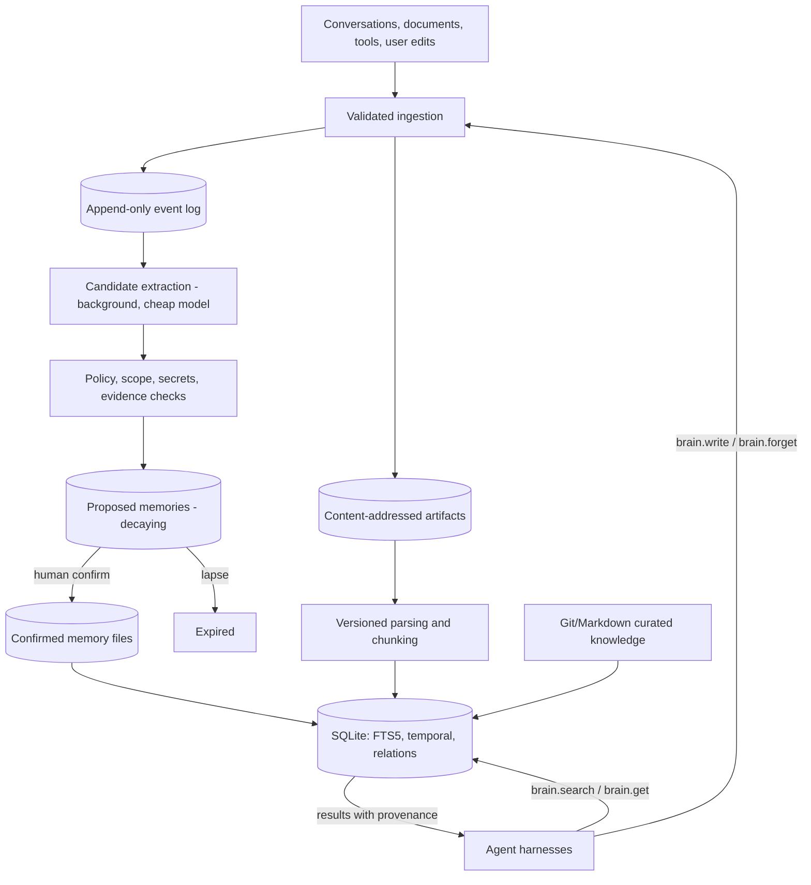

# The Brain — Consolidated Architecture and Implementation Blueprint

**Status:** Consolidated recommendation. Supersedes `RESEARCH.md`, `RESEARCH-COUNTERPOINTS.md`, and `RESEARCH-ADJUDICATION.md` as the working design.
**Date:** 2026-08-03
**Target:** Local-first, single-user, production-grade, with a defined path to shared deployment.
**Clients:** Claude Code, OpenAI Codex, OpenCode, Cursor, Aider, and generic MCP clients.

---

## 0. How This Document Was Produced, and How to Read It

Three prior documents staged a genuine argument:

- **`RESEARCH.md`** — a layered, provenance-heavy, database-backed system with a ten-step hybrid retrieval pipeline feeding a context builder.
- **`RESEARCH-COUNTERPOINTS.md`** — an argument that the above is over-built 2024-shaped RAG; proposes markdown + git + ripgrep + an agentic tool loop, shipped in days.
- **`RESEARCH-ADJUDICATION.md`** — a reconciliation arguing the correct architecture is a function of how long the brain has been running, plus material neither prior document contained.

This document does not summarize that argument. It **decides** it. Every place the three disagreed is resolved below, and each resolution is labelled **[D-n]** with the reasoning attached, so a reviewer can attack the decision rather than reverse-engineer it. Section 20 grades the evidence each decision rests on.

Where all three documents agreed, the conclusion is stated once and not re-argued.

Three decisions here differ from **all** of the prior documents. They are flagged **[NEW]** and are the ones most worth reviewing: **[D-1]** (§6.2, the erasability line), **[D-4]** (§6.3, files canonical everywhere, zero canonical data in SQLite), and **[D-27]** (§18, build-versus-adopt and the project kill criterion).

**This document has been through adversarial review.** It was attacked over fourteen rounds by an independent reviewer (Codex/GPT-5) under a protocol requiring each side to state a position, argue it, and either concede or refute — not merely exchange comments. Forty-three findings were raised and every one was resolved. The review changed the architecture materially: it produced the revised **[D-4]**, the write protocol in **§6.5**, the trust-tier gate in **§7.5**, and the currency limitation in **§11.5.3**. Two of the defects it caught were regressions introduced *during* the review by earlier attempts at a fix, not pre-existing flaws. **Appendix B records the full log**, including the positions that were wrong, because a design's failed attempts are more useful to the next reader than a clean surface.

---

## 1. Executive Summary

A first-class agent second brain is not a vector database and not a folder of notes. It is a durable information system that preserves evidence, remembers selectively, retrieves within a bounded budget, resolves contradictions over time, explains where every memory came from, forgets completely on request, and survives changes of model, embedding provider, database, and agent vendor.

**The design in one paragraph.** Markdown files with YAML front matter are canonical for every durable record. Git tracks exactly one class of those files — curated, human-authored, never-to-be-erased knowledge. Mutable memory lives in files outside git so that erasure remains a `rm` plus a tombstone rather than a history rewrite. SQLite is a rebuildable index over everything, providing BM25 search, as-of queries, and relational traversal. The agent reaches all of it by calling four MCP tools in a loop; nothing is auto-injected into the prompt prefix. Models propose memory writes, deterministic code enforces policy, and anything written without human confirmation decays on a timer. Retrieval is a swappable ladder behind a stable tool boundary — lexical first, dense and reranking added only when a written trigger fires.

**The central principle:**

> Preserve evidence in boring, inspectable storage. Treat chunks, embeddings, summaries, confidence scores, graph edges, and rendered model context as replaceable projections. Decide the storage line by what you may one day have to erase, not by what changes.

**The single most important finding**, from the evidence that postdates the prior documents: the *ranking of memory architectures inverts with tenure*. A cheap curated map wins at three weeks and loses at nine; a provenance-typed store loses at three weeks and wins at nine ([Ground Truth First, arXiv 2607.21962](https://arxiv.org/abs/2607.21962)). The correct response is not to pick a side. It is to **build the cheap thing and pre-commit, in writing, to the expensive thing on a measured trigger** — because nothing in any prior document measured recall against a *growing* corpus, which is the only way to detect the crossover.

---

## 2. Scope: Goals and Explicit Non-Goals

### 2.1 The three things this project is for

Agent harnesses now ship file-based memory, front matter, index files, on-demand topic files, skills, and MCP. Rebuilding those is waste. The differentiated value of this system is exactly three properties, and storage is not one of them:

1. **Evidence** — every durable claim traceable to a source span in preserved original material.
2. **Forgetting** — deletion that propagates to every derived representation and survives backup restore.
3. **Portability** — the store outlives any harness, model, or vendor.

### 2.2 Declared non-goals **[D-2]**

Written down so scope creep is a visible violation rather than a drift:

- **Do not rebuild what the harness ships.** No custom context injector, no custom skill loader, no reimplementation of `CLAUDE.md` semantics.
- **Do not chase harness-specific adapters as planned scope.** `AGENTS.md` + one MCP server + one CLI covers all five targets by construction. Harness-specific files are contingency work, done when a specific harness demonstrably breaks.
- **No automatic entity resolution in the MVP.** At single-user scale a hand-maintained alias list of ~200 entries beats a model, and entity resolution is documented as unsolved in production in the temporal-knowledge-graph literature.
- **No multi-user, no ACLs, no concurrent writers in v1** — but every record carries `workspace` and `owner` fields from day one so migration is not a data-model rewrite.
- **No vector server, no graph database, no reranker** until its written entry trigger fires. All four triggers — dense retrieval, graph store, PostgreSQL, dedicated search service — are in §13, and the retrieval ladder they gate is in §9.2. Standing rejections are in §17.

---

## 3. Vocabulary That Must Stay Distinct

Most weak memory designs fail by using "memory" for unrelated mechanisms.

| Term | Meaning | Durable? | Authoritative? |
|---|---|---|---|
| Working context | What one model call sees | No | No |
| Session history | Ordered messages and tool events for one thread | Usually | As evidence, if unmodified |
| Checkpoint | Serialized workflow state for resumption | Usually | For recovery only |
| Compaction | Shortened representation of prior context | Sometimes | No — lossy and provider-specific |
| Episodic memory | Selected experiences, outcomes, trajectories | Yes | Only with provenance |
| Semantic memory | Extracted facts, concepts, preferences | Yes | Only with evidence and temporal scope |
| Procedural memory | Instructions, workflows, skills, lessons | Yes | Curated procedural knowledge can be |
| Knowledge / RAG | External documents and reference material | Yes | The source document may be |
| Retrieval index | FTS, vector, graph, ranking data | Rebuildable | Never |

Consequences: a checkpoint is not a user profile; a vector hit is not proof; prompt caching changes cost, not persistence; compaction cannot replace source history; a larger context window solves none of relevance, provenance, staleness, deletion, or authorization.

---

## 4. The Tenure Finding, and What It Actually Licenses

### 4.1 The evidence

[Ground Truth First](https://arxiv.org/abs/2607.21962) (July 2026) inverted the usual benchmark pipeline: emit facts first — each with a validity interval, a **volatility class**, and a source channel — then generate text from them, then instantiate gold answers mechanically. ~380 questions, 15 types, five architectures, released as the `Veracium` library.

| Architecture | ~3 weeks | ~9 weeks |
|---|---:|---:|
| Budget-conscious curated map | 96% recall | **72%** |
| Provenance-typed graph | lower | **90%** |

The ranking inverts, and the inversion held across all six test users (p = 0.031). Two supporting findings: **write-stage quality dominates** — weakly-written facts failed downstream retrieval at 24% versus 2% for well-written ones — and **full-rendered-history baselines tied the best memory systems at short horizons** at roughly twice the read cost.

### 4.2 The honest discount

Verified as a real preprint (arXiv 2607.21962, Quentin Spencer, 24 July 2026). But: **single author, one research group, n = 6 synthetic users, synthetic corpus scored by its own author, p = 0.031, unreplicated.** That is a weak signal and this document treats it as **directional only**.

### 4.3 What it licenses **[D-3]**

It does not license building the heavy architecture now. It licenses exactly one thing: **instrumentation that can detect the crossover, plus a written trigger.** The mechanism is independent of the paper and defensible without it — a curated map degrades through *eviction*, because curation does not scale sublinearly with corpus size and human attention does not scale at all. If the paper fails to replicate, the instrumentation is still correct.

So: build cheap, measure the **slope** of recall against corpus size, and write the migration trigger down before writing code. The prior documents contemplated a migration trigger but defined it on the wrong axis (concurrency) or not at all.

---

## 5. Invariants

Eleven rules that no phase may violate. Everything downstream is derivable from these.

1. **Evidence is immutable — which means never edited in place, not never deleted.** Original bytes are content-addressed and never mutated. Erasure removes a whole blob and tombstones its digest; it never rewrites one. (§11.5)
2. **Projections are disposable.** FTS rows, chunks, embeddings, summaries, and graph edges must be deletable and rebuildable from canonical state with no data loss. **SQLite holds zero canonical bytes** (§6.3).
3. **Nothing is canonical in two places.** Exactly one store answers for each record class. Present state and past state are disjoint domains with a defined handoff, not two authorities (§6.6).
4. **Erasability decides storage.** Anything that may need to be erased never enters an append-only immutable history. (§6.2)
5. **Retrieved content is data, never instruction.** It never appears in a system or developer channel, and never reaches a file the harness loads as instructions except by human commit.
6. **Models propose; code enforces policy.** Code validates schema, scope, secrets, evidence existence, idempotency, and retention. Code does **not** validate truth, and the document says so plainly. (§8.4)
7. **Unconfirmed memory decays.** Anything written without human confirmation carries an expiry.
8. **Consolidation appends and restructures curated artifacts; it never regenerates them.** No pipeline step rewrites `AGENTS.md`, a skill, or `knowledge/` wholesale. Derived summaries are projections and *are* freely regenerable — the distinction is whether the artifact accumulates human judgment (§8.6).
9. **Retrieval is a tool call the agent makes, not a prefix the system mutates.** Memory use is visible in the answer.
10. **When the system cannot determine the right answer, it says so.** Ambiguity is surfaced, never resolved by guessing: malformed files are quarantined (§7.6), write divergence persists both branches (§6.5), conflicting facts return an `unresolved_conflict` marker (§7.5), and an unverifiable restore refuses to serve (§11.5).
11. **A safety property is never established from inside the domain whose integrity is in question.** A backup cannot vouch for its own currency; a writer cannot vouch for a tree it does not exclusively control. Anchors come from outside. (§11.5.3)

---

## 6. Architecture

### 6.1 Layers

1. **Curated knowledge** — human-owned Markdown: `AGENTS.md`, Agent Skills, decision records, policies, runbooks. Git-tracked.
2. **Mutable memory** — typed memory records with revisions, provenance, temporal validity, and status. Files outside git.
3. **Original evidence** — immutable, content-addressed artifacts: imported documents, conversations, HTML, tool results.
4. **Derived retrieval data** — FTS5 rows, chunks, embeddings, summaries, relation edges. Rebuildable.
5. **Interface** — a neutral CLI plus MCP resources and four tools. Harness-specific files are generated adapters, never canonical state.

### 6.2 The storage line is erasability, not mutability **[D-1] [NEW]**

All three prior documents drew this line wrong, in different directions.

- `RESEARCH.md` §7.1 put **mutable** memory in SQLite and curated knowledge in git. The axis is wrong: mutability is not what makes git a bad host.
- `RESEARCH-COUNTERPOINTS.md` §6 proposed git as the universal substrate — immutable revisions, transaction time, supersession, content hashes, audit, rollback, review, all free.
- `RESEARCH-ADJUDICATION.md` §10.1 correctly refuted that on two grounds — **git has no valid-time**, and **git makes erasure maximally hard** — and concluded that markdown-canonical should be scoped to non-erasable curated knowledge.

The adjudication's refutation is right about git and **wrong about files**. It conflated *markdown-canonical* with *git-canonical*. They are separable, and separating them is the better synthesis:

- The valid-time objection is an objection to inferring validity from commit timestamps. It dissolves the moment `valid_from` is a **front-matter field** and the SQLite index makes it queryable. Files have valid-time; git does not.
- The erasure objection is real and specific to git's immutable history. It does not apply to a plain file, where erasure is `rm`, a tombstone, and a reindex.

**Therefore:**

| Class | Canonical store | Git-tracked? | Erasure procedure |
|---|---|---|---|
| Curated knowledge — policies, skills, ADRs, `AGENTS.md` | Markdown files in repo | **Yes** | Not required; this class is never erased by design |
| Mutable memory — episodic, semantic, preference, task | Markdown files in `$XDG_STATE_HOME/brain/memories/` | **No** | `rm` + tombstone + reindex |
| Original artifacts | Content-addressed blobs in `$XDG_STATE_HOME/brain/artifacts/` | **No** | `rm` + tombstone + reindex |
| Revision history of mutable memory | Files in `memories/.revisions/` | **No** | `rm` + tombstone + reindex |
| Event log | `events/YYYY-MM-DD.jsonl` | **No** | Redaction fork + tombstone (§11.5.4) |
| Erasure ledger | `tombstones.jsonl`, replicated, **outside the backup rollback domain** (§11.5.3) | **No** | Append-only; never erased |
| All indexes | SQLite — **zero canonical bytes** (§6.3) | **No** | Drop and rebuild |

The rule that makes this safe: **admission to the git-tracked class is a human decision made at commit time.** Nothing is promoted into it automatically. If a record could ever contain PII, a secret, a third-party claim, or something retractable, it does not go in git.

This is a strictly stronger position than any prior document. It keeps everything `COUNTERPOINTS` wanted from files — agent-native `Read`/`Grep`/`Glob` work directly, export is a no-op because markdown *is* the format, Phase 1 shrinks by an order of magnitude of code — while conceding both of the adjudication's objections in full rather than arguing past them.

### 6.3 Revision history without git, and without a canonical database **[D-4] [NEW]**

Dropping git for mutable memory costs the free revision history in `COUNTERPOINTS` §6's table. This is a feature, not a loss: you want memory history to be **purgeable**, which is precisely what git refuses to be.

An earlier draft replaced it with a SQLite `memory_revisions` table, and then had to carve that table out of invariant §5.2 as a non-rebuildable exception. That exception was the wrong answer. The right one is to remove the need for it:

> **SQLite holds zero canonical data. Every byte of canonical state is a file. The index is a total function of the files and is always safe to drop.**

Canonical state is therefore exactly three file classes:

```text
memories/<type>/<id>.md            # materialized view of the latest committed state
memories/.revisions/<id>/<n>.md    # append-only log of EVERY committed state
events/YYYY-MM-DD.jsonl            # append-only event log (§6.4)
tombstones.jsonl                   # append-only erasure ledger (§11.5)
```

**The revision log contains every committed state, including the current one** — it is not a log of superseded states. This matters more than it looks, and an earlier draft got it wrong in a way that survived nine rounds of design review and was only caught when the write protocol was written as code:

If revisions held only *prior* states, then `hash(present) != hash(latest revision)` would be true by construction for every memory, always — and that comparison is exactly what §6.6 uses to detect an unwitnessed edit. The detector would fire on every record forever. §6.6 was unimplementable against that reading.

So: **the present file is a materialized view of the newest revision.** After a mediated write the two are byte-identical, and any divergence between them is real information (§6.6). Recorded in Appendix B as V11.

This buys four things at once, each of which was a defect in the earlier draft:

1. **Invariant §5.2 holds universally.** No exceptions, no carve-outs, no "except this table."
2. **Phase 0.5 satisfies every invariant on day one** (§15). A JSONL append and a file copy are not infrastructure, so the cheap first phase no longer has to be excused for violating the design's own rules.
3. **The atomicity problem collapses** (§6.5). Two stores that must both commit is a hard problem; one canonical store plus a derived index is not.
4. **Erasure stays a file operation** throughout — `rm` plus a tombstone — rather than a file operation *and* a row purge that must agree.

### 6.4 The event log

Evidence pointers (§7.1) have to resolve against something. That something is an append-only JSONL event log, segmented by day, holding messages, tool calls, observations, and feedback. It is canonical, it is a file class, and it is a Phase 1 deliverable. An earlier draft showed it in the dataflow and then defined it nowhere — it had no store, no schema, and no phase.

Events are erasable on the same terms as everything else — **by redaction fork, never by in-place rewrite** (§11.5.4). Editing a segment in place would violate invariant §5.1.

### 6.5 The write protocol **[D-28]**

Because SQLite is derived, there is no distributed transaction here — only durable ordering and idempotent replay. Every mutation follows one sequence:

```text
0. allocate revision n+1 with O_CREAT|O_EXCL  — never rename over a revision
   record predecessor_hash = what the caller believed it was editing
1. write new body -> .revisions/<id>/<n+1>.md   fsync(file), fsync(dir)
2. stage new body -> <id>.md.new                fsync
   renameat2(<id>.md, <id>.md.new, RENAME_EXCHANGE)   — ATOMIC SWAP
   h = hash(<id>.md.new)   # whatever was ACTUALLY present at the swap instant
     h == predecessor_hash -> commit; discard the staged copy
     h != predecessor_hash -> swap back; record h as capture: reconciled;
                              raise DIVERGENCE; present unchanged
   fsync(dir)
3. update the SQLite index                                          (WAL)

crash at any point -> `brain reindex` from files. Always valid, always terminating.
```

Two properties of step 2 are load-bearing, and a plain `rename` has neither.

**The displaced bytes must be captured at the instant of displacement, not read beforehand.** A design that hashes the present file, then later renames over it, loses any write that lands in between — no crash required:

```text
present=A -> writer reads/hashes A, CAS ok -> editor renames B over present
          -> writer renames C over present.   B is destroyed, unrecorded.
```

`RENAME_EXCHANGE` closes this: the swap hands us whatever was actually there, so an unwitnessed edit ends up in our hands instead of under a name we are about to overwrite. Where the syscall is unavailable, the fallback's residual window is documented and asserted in a test rather than left implicit.

**Revisions are allocated exclusively, never renamed over.** `rename()` silently overwrites, so a crash-retry or a concurrent allocator could destroy immutable history using the very mechanism meant to preserve it — invariant §5.1, violated from the inside. `O_CREAT|O_EXCL` makes that impossible. Gaps in the sequence are legal and mean an abandoned allocation.

History is durable *before* present state changes. A crash between 1 and 2 leaves an orphan revision; between 2 and 3, a stale index that `reindex` repairs by definition. **No crash point loses canonical data.**

**Distinguishing an interrupted write from an unwitnessed edit.** Because the revision log includes the current state (§6.3), a crash between steps 1 and 2 leaves `hash(present) != hash(latest revision)` — which looks exactly like a direct edit. `predecessor_hash` decides it:

```text
revision(n+1).predecessor_hash == hash(present) -> interrupted mediated write; replay step 2
otherwise                                       -> unwitnessed edit; reconcile (§6.6)
```

**Compare-and-swap is what makes recovery decidable.** Hash detection alone cannot distinguish an orphan revision from an intended one, and an earlier draft claimed it could. `predecessor_hash` resolves all three cases:

| `predecessor_hash` matches | Meaning | Action |
|---|---|---|
| the current present file | intended write | commit |
| an **older** revision | **divergence** — two branches from one predecessor | **persist both, change nothing** (below) |
| nothing | abandoned or corrupt write | quarantine — never silently discard |

**Divergence is never auto-resolved.** An earlier draft treated a mismatch as "superseded by a direct edit, reconcile it" — which silently picks a winner between a mediated correction and a concurrent direct edit, and discards the loser. That is data loss dressed as recovery, and it contradicts the fail-closed posture taken everywhere else (§7.6, §11.5). On divergence:

- persist **both** branches as immutable revisions;
- mark the memory **contested**;
- create an explicit conflict record;
- surface it in `brain validate` and `brain conflicts`;
- **all reads return `unresolved_conflict` until a human resolves it**;
- require human resolution.

**A correction: "leave present state unchanged" is not achievable, and an earlier draft required it.** The filesystem offers no primitive for "swap, inspect, and conditionally undo" — that is three operations, and the undo is itself a non-atomic read-modify-write that races the next editor write:

```text
stage C -> exchange: present=C, .new=B   (an editor had written B)
detect B != A -> editor writes D over present
exchange back: present=B, .new=D          <- D clobbered, C lost
```

Attempting the rollback *creates* the data loss it was meant to prevent. So the guarantee is restated as one that can actually be kept:

> **No committed state is ever lost, and a contested memory never serves one branch as though it were settled.**

Present may hold either branch after a divergence. That is acceptable because **present is not authoritative while contested** — reads fail closed rather than returning it. This is the same mechanism §7.5 uses at the retrieval boundary and the same posture as invariant 10. Trading an unachievable guarantee for an enforceable one is the right direction; asserting the former would be exactly the kind of unearned claim §20 criticizes the field for.

**Concurrency.** "Single user" does not mean single process: two harnesses running at once is the normal case, not an edge case. Mediated writes serialize through one writer service and take a per-memory advisory lock. But **CAS, not the lock, is the safety mechanism** — an editor writing the file directly ignores advisory locks entirely, so a lock can only reduce contention among writers that honor it. Any design that relies on locking here is relying on cooperation it does not have.

### 6.5.1 Platform preconditions

The protocol assumes **same-volume atomic rename and durable `fsync`**. Neither holds on network filesystems or on directories managed by file-sync clients, where rename may not be atomic and `fsync` may return before data is durable.

`brain` checks this at startup and **refuses to run** on network mounts and known sync folders (Dropbox, iCloud Drive, OneDrive, Syncthing), with an error naming the reason. This generalizes the long-standing "never put a live WAL database on a network filesystem" rule to the entire canonical tree — a rule that applies with *more* force now that the files are the database.

### 6.6 Direct edits, and the limit of what can be captured

The design actively encourages editing memory files in an ordinary editor and with agent-native `Edit` — that is a stated benefit of files being canonical (§6.2). It follows that some mutations will not pass through §6.5. This must be handled, and handled honestly.

**What a direct edit cannot do: destroy history.** Revision `n-1` is already durably on disk before any subsequent edit occurs. An unmediated write can only (a) fail to record intermediate states between two reconciliations, and (b) blur transaction time. It cannot make the present state and the recorded past disagree about the present, because exactly one artifact answers for present state: the file.

**Reconciliation is pull-based, and must verify quiescence.** A filesystem watcher would be the wrong mechanism — it can start after the write, coalesce saves, miss an atomic rename, or crash between observing and recording. Pull-based hash comparison removes the race *with the watcher*, but not the race *with the editor*: a hash taken mid-save reads a torn file. So the read must be verified stable before anything is captured.

```text
on `brain reindex`, `brain validate`, or any tool-mediated read:

  read (size, mtime_ns, hash); wait; re-read
    not identical                  -> defer, warn, retry next pass. NEVER snapshot.
    editor sidecars present
      (.swp, .swx, #file#, .~lock) -> defer
    parse failure                  -> quarantine, fail closed (§7.6)

  if stable AND hash(file) != hash(latest revision):
      snapshot as revision n+1 with capture: reconciled
      record recorded_at as an INTERVAL [last_known_good, now] — never a point
      emit a warning naming the unwitnessed transition
```

A file that never stabilizes is **reported, not guessed at.**

Every revision therefore carries `capture: mediated | reconciled | imported`. For `reconciled` revisions, transaction time is a **bounded interval, not a false point value.** Honest and auditable is achievable; precise is not, and pretending otherwise would corrupt the audit trail §11.7 depends on.

**On invariant §5.3** ("nothing is canonical in two places"): present state and past state are disjoint domains over the same record, with a defined handoff — a body becomes a revision at the moment it stops being present. That is ordinary event sourcing, not dual authority. Read otherwise, §5.3 would forbid every append-only log ever written.

### 6.7 Data flow

The arrow direction is the load-bearing change from `RESEARCH.md` §7. Retrieval no longer pushes into a context builder; the agent pulls.



### 6.8 Repository and state layout

```text
# Git-tracked — the repo
brain/
|-- AGENTS.md                     # concise; pointers only
|-- docs/
|   |-- BLUEPRINT.md              # this file
|   |-- decisions/                # ADRs — see §18
|   `-- runbooks/
|-- knowledge/                    # curated, human-authored, never erased
|   |-- policies/
|   |-- references/
|   `-- schemas/
|-- .agents/skills/
|-- eval/
|   |-- golden.yaml               # fixed question set — never regenerated
|   |-- state-facts.yaml          # known-true facts for the recovery probe
|   `-- results/                  # weekly runs, committed, for slope tracking
|-- interoperability/
|   |-- manifest.json
|   `-- adapters/                 # generators only; output is gitignored
`-- src/

# Not git-tracked — mutable state, XDG.  CANONICAL = the files below.
$XDG_STATE_HOME/brain/
|-- memories/
|   |-- <type>/<id>.md              # canonical: present state
|   `-- .revisions/<id>/<n>.md      # canonical: prior states, append-only
|-- events/YYYY-MM-DD.jsonl         # canonical: append-only event log
|-- artifacts/sha256/ab/cd/<digest>/ # canonical: original evidence bytes
|-- quarantine/                     # files failing schema validation (§7.6)
|-- brain.sqlite3                   # DERIVED. Always safe to delete.
`-- backups/

# Canonical, and deliberately OUTSIDE the database backup/rollback domain (§11.5)
$XDG_STATE_HOME/brain/tombstones.jsonl
<independently replicated copies>
```

The state directory is deliberately outside the repo, not merely `.gitignore`d, so that an accidental `git add -A` cannot capture it.

---

## 7. Data Model

### 7.1 Six required fields, not fourteen **[D-5]**

`RESEARCH.md` §8.3 demanded fourteen metadata fields on every revision. `COUNTERPOINTS` §6.2 correctly called that absurd for one-sentence memories and proposed five. The adjudication agreed and identified that the single most load-bearing field was absent from all fourteen. Final set:

| Field | Values | Why required |
|---|---|---|
| `id` | stable, path-independent (ULID) | Paths and titles must never be identity |
| `type` | `episodic` / `semantic` / `preference` / `procedural` / `task` | Determines lifecycle and review policy |
| `provenance_class` | see §7.3 | Replaces confidence floats; drives precedence |
| `volatility` | `immutable` / `slow` / `volatile` / `ephemeral` | Determines decay, re-confirmation, expiry |
| `valid_from` | ISO-8601 | Valid-time anchor; makes as-of queries possible |
| `evidence` | pointer(s) to event/chunk/artifact + span | Without this the claim is unverifiable |

Everything else — `valid_to`, `supersedes`, `owner`, `workspace`, `sensitivity`, `tags`, `review_by`, `extractor_version`, `content_hash` — is **optional and defaulted**. `status` and `recorded_at` are set by the system, not the author.

### 7.2 Volatility is the field everything else hangs off **[D-6]**

`RESEARCH.md` §11.4 contains the best line in any of the three documents — *"decay should affect activation, not truth"* — and then applies decay as a single global ranking signal. That is guaranteed wrong, because facts about a person have wildly different half-lives:

| Class | Example | Decay | Re-confirm | Default expiry |
|---|---|---|---|---|
| `immutable` | "I was born in March" | none, ever | never | none |
| `slow` | "I prefer concise summaries" | very slow | on contradiction only | none |
| `volatile` | "I'm using Postgres for this project" | fast | aggressively, on every related query | 180 days → review |
| `ephemeral` | "I'm blocked on the auth bug" | immediate | never | 14 days → expire |

The failure this prevents is concrete and is a **consolidation** failure that no amount of reranking fixes: confidently telling someone they are still on Postgres six weeks after they migrated.

Volatility is required at write time and is the only field an extractor is allowed to guess conservatively — the safe default is `volatile`, because over-expiring is recoverable and under-expiring is not.

### 7.3 Provenance class, and the precedence table that makes it auditable **[D-7]**

`COUNTERPOINTS` §7.1 argued for dropping LLM confidence floats in favour of a categorical provenance class. Correct: a `0.92` is poorly calibrated, and `RESEARCH.md` §11.4 then proposed feeding it into ranking, multiplying false precision into retrieval order.

The adjudication's §10.3 correction is also correct and is adopted: a categorical class is only auditable if the **ordering over categories is written down**, otherwise you have swapped an unauditable float for an unauditable implicit ordering.

So the ordering is written, here, as code — not as prose:

```text
PRECEDENCE (higher wins):
  1. direct-user-statement          user asserted it in their own words
  2. authoritative-document         a source the user has designated authoritative
  3. verified-environment-outcome   test result, command exit, tool observation
  4. third-party-document           ingested material of unverified authority
  5. inferred-from-behavior         derived from observed patterns
  6. agent-speculation              model inference with no direct support
```

Note that `authoritative-document` outranks nothing above it but **does** outrank `inferred-from-behavior` and `third-party-document`. The non-obvious case the adjudication flagged — an authoritative document versus a user's offhand remark from eight months ago — is handled not by the class ordering but by the tie-break chain in §7.5, where recency and volatility enter.

### 7.4 Bitemporality is data, not a rule **[D-8]**

Valid time (when the fact was true in the world) and transaction time (when the brain learned it) must both be recorded. `RESEARCH.md` §8.4 records both and stops there.

[TOKI](https://arxiv.org/pdf/2606.06240) identifies the gap precisely: naive bitemporal modelling leaves "which version is true now" **ambiguous when contradictory facts have overlapping validity intervals**. Storing two timestamps gives you the data a resolution rule would operate on; it is not the rule.

### 7.5 The conflict resolution rule, written as code **[D-9]**

This is required before Phase 1, not during it. A written wrong rule is auditable; a missing rule is not.

Getting this rule right took two failed attempts, and both failures are instructive enough to record rather than hide.

**Attempt 1 — precedence first, recency second.** Wrong in exactly the way §7.2 warns about: a `direct-user-statement` from eight months ago beats a `verified-environment-outcome` from today. That is the Postgres-to-MySQL failure, reproduced by the rule meant to prevent it.

**Attempt 2 — recency dominates for `volatile` claims.** Worse. It converted a staleness bug into an **injection path**: any claim tagged `volatile` could override trusted evidence merely by being newer, and volatility is assigned by an extractor that reads attacker-controlled text. An attacker could win a precedence contest by writing text that gets classified volatile.

The error in both was treating precedence as one ordering to re-sort. It is **two questions**: *may this class override that one at all*, and *among those that may, which is current*. Trust answers the first and must be a hard gate; recency answers the second and operates only inside it.

```text
TRUSTED   = direct-user-statement, authoritative-document, verified-environment-outcome
UNTRUSTED = third-party-document, inferred-from-behavior, agent-speculation

resolve(candidates for one (entity, attribute) at time T):
  1. Discard candidates whose [valid_from, valid_to) does not contain T.
     Discard tombstoned candidates.

  2. HARD GATE — trust tier. If any TRUSTED candidate is valid at T,
     UNTRUSTED candidates cannot win and are excluded from ranking.
     A contradicting UNTRUSTED candidate still raises `unresolved_conflict`.

  3. Within the surviving tier, gate on volatility:
       volatile | ephemeral  ->  valid_from desc, then precedence class
       slow | immutable      ->  precedence class, then valid_from desc

  4. Tie-break: later transaction time wins.
  5. Tie-break: narrower valid-time interval wins (more specific claim).
  6. Unresolved -> return the top candidate PLUS an `unresolved_conflict`
     marker naming the competitor.
```

Why this holds in both directions:

- **Injection is closed.** No untrusted claim overrides a trusted one at any volatility. Step 2 runs before volatility is consulted, so a mis-set or attacker-influenced `volatility` field buys nothing across the tier boundary.
- **Staleness stays fixed.** Authoritative document versus a user's stale remark — both TRUSTED, both `volatile`, so recency wins and the document wins. That is the case §7.3 deferred and a fixed ordering cannot reach.
- **Step 2 excludes but does not silence.** A contradicting untrusted claim still surfaces as `unresolved_conflict`. Silently dropping it would be its own failure: *"the vendor docs say you migrated"* is precisely the signal you want raised even when it must not win on its own.

**Returning both facts silently is illegal at the retrieval boundary.** The consolidation literature is unanimous that handing a model two contradictory facts about one entity produces incoherent output even from strong models. The retriever returns one fact plus an explicit marker, or it returns one fact.

### 7.6 Memory file format

```markdown
---
id: 01K1Z8V4Q0000000000000000
type: preference
provenance_class: direct-user-statement
volatility: slow
valid_from: 2026-08-02
evidence:
  - event:01K1Z8V3M0000000000000000#L44-L47
status: confirmed
---

Prefers concise implementation summaries over narrated step-by-step output.
```

Conventions: stable IDs independent of path; UTF-8 and LF; relative links; `[[wikilink]]` for relations, validated by `brain validate`; no secrets in front matter or body; a versioned front-matter JSON Schema in `knowledge/schemas/`; generated projections clearly marked as such.

**Malformed files fail closed.** Because humans and agents edit these files directly, invalid front matter is a normal occurrence, not an exceptional one. A file that fails schema validation is **quarantined**: excluded from all retrieval, never indexed, and surfaced by `brain validate` with a nonzero exit code. It is not best-effort parsed and it is not silently skipped. Silent skipping is the dangerous option, because it makes a memory disappear from answers without anyone being told — indistinguishable, from the user's side, from the brain having forgotten.

Artifacts are stored by digest with the original URI, media type, capture time, parser version, and access policy preserved:

```text
$XDG_STATE_HOME/brain/artifacts/sha256/ab/cd/abcdef.../source.html
```

### 7.7 SQLite index schema — entirely derived

**Every table below is rebuildable by scanning the canonical files.** Dropping `brain.sqlite3` loses nothing. There are no exceptions; that is the point of §6.3.

```sql
-- Scanned from memory files + curated markdown + artifacts + event log.
CREATE TABLE memory_index (
    id             TEXT PRIMARY KEY,
    file_path      TEXT NOT NULL,
    type           TEXT NOT NULL,
    provenance     TEXT NOT NULL,
    volatility     TEXT NOT NULL CHECK (volatility IN
                     ('immutable','slow','volatile','ephemeral')),
    status         TEXT NOT NULL CHECK (status IN
                     ('proposed','confirmed','superseded','expired','tombstoned')),
    valid_from     TEXT NOT NULL,
    valid_to       TEXT,
    recorded_at    TEXT NOT NULL,
    review_by      TEXT,
    workspace      TEXT NOT NULL DEFAULT 'default',
    owner          TEXT,
    content_hash   TEXT NOT NULL
);
CREATE INDEX idx_valid  ON memory_index (workspace, valid_from, valid_to);
CREATE INDEX idx_review ON memory_index (status, review_by);

CREATE TABLE evidence_link (
    memory_id  TEXT NOT NULL,
    source_ref TEXT NOT NULL,          -- event:… | artifact:… | chunk:…
    span_start INTEGER,
    span_end   INTEGER,
    PRIMARY KEY (memory_id, source_ref, span_start)
);

CREATE TABLE relations (
    src TEXT NOT NULL, rel TEXT NOT NULL, dst TEXT NOT NULL,
    evidence_ref TEXT,
    PRIMARY KEY (src, rel, dst)
);

CREATE VIRTUAL TABLE search USING fts5(
    memory_id UNINDEXED, kind UNINDEXED,
    title, body, tags,
    tokenize = 'unicode61'
);

-- DERIVED: scanned from memories/.revisions/. The FILES are canonical (§6.3).
-- This table exists so history is queryable, not so it is stored.
CREATE TABLE revision_index (
    memory_id        TEXT NOT NULL,
    revision_no      INTEGER NOT NULL,
    file_path        TEXT NOT NULL,
    content_hash     TEXT NOT NULL,
    predecessor_hash TEXT,                  -- CAS anchor (§6.5)
    capture          TEXT NOT NULL CHECK (capture IN
                       ('mediated','reconciled','imported')),
    recorded_from    TEXT NOT NULL,         -- interval start; == end if mediated
    recorded_to      TEXT NOT NULL,         -- interval end   (§6.6)
    actor            TEXT,
    session          TEXT,
    operation_id     TEXT,                  -- ties to the audit record (§11.7)
    reason           TEXT,
    PRIMARY KEY (memory_id, revision_no)
);

-- DERIVED: scanned from tombstones.jsonl. The LEDGER is canonical (§11.5).
CREATE TABLE tombstone_index (
    subject_id    TEXT PRIMARY KEY,
    subject_kind  TEXT NOT NULL,
    tombstoned_at TEXT NOT NULL,
    chain_seq     INTEGER NOT NULL,
    reason        TEXT
);
```

Note `recorded_from` / `recorded_to`: transaction time is an **interval**, not a point. For `mediated` writes the two are equal. For `reconciled` writes they bound an unwitnessed transition (§6.6), which is the honest representation and the only one the audit trail in §11.7 can stand on.

Keep migrations conceptually PostgreSQL-compatible; avoid SQLite behaviour that cannot be reproduced, while still using FTS5 locally.

---

## 8. The Write Path

### 8.1 What triggers a write **[D-10]**

`RESEARCH.md` specified a ten-step write pipeline and **never said what invokes it** — the most consequential omission in the original document, because the trigger dominates cost, noise, and poisoning exposure more than any storage choice.

`COUNTERPOINTS` §8 proposed explicit-first and was right about cost and poisoning. The adjudication identified the failure mode that recommendation walks into, and it is the correct objection: **explicit-only writes have near-zero capture rate. Every personal knowledge system in history died of disuse, not corruption.** A brain that only remembers what you consciously told it is a notes app, and you already have one.

The synthesis — capture like an implicit system, trust like an explicit one:

| Path | Trigger | Lands as | Expiry | Cost |
|---|---|---|---|---|
| Explicit | user says "remember this" | `confirmed` | per volatility | ~0 |
| Session-end batch | session close, background, cheap model | `proposed` | **30 days** | amortized, off critical path |
| Scheduled consolidation | nightly/weekly, background, delta-only | `proposed` | 30 days | amortized |
| Per-turn | **never** | — | — | — |

The load-bearing move is that **the batch path writes freely, but everything it writes is on a decay timer.** Capture rate rises, poisoning exposure stays bounded, and the accretion dynamic that degrades memory systems over months is inverted: unconfirmed, never-cited memories lapse on their own.

Background paths use a cheaper model and a narrower toolset. [Sleep-time compute](https://arxiv.org/abs/2504.13171) reports roughly 5× reduction in test-time compute for equivalent accuracy when non-latency-critical work moves off the interactive path, and ~2.5× lower per-query cost when amortized across related queries.

### 8.2 The review surface is a deliverable, and "fast" is not the criterion **[D-11]**

This is the failure point of the entire §8.1 design. **If reviewing proposals is a chore, every proposal expires and you are back to explicit-only** — with the extraction cost still being paid. Budget a real review UI: a queue, keyboard-driven confirm/edit/reject, showing the claim, its evidence span, and its proposed volatility.

But **speed is the wrong acceptance criterion, and optimizing for it is dangerous.** A one-keystroke confirm under automation bias produces rubber-stamping, and rubber-stamping re-opens the exact poisoning path §8.5 exists to close. Cheap review is only worth having if it is real review.

The criterion is therefore *fast **and** discriminating*, measured three ways:

| Measure | Target | Why |
|---|---|---|
| Median time-to-decision | low | Review must not be a chore, or capture collapses |
| **Rejection rate** | **non-trivial — a rate near zero is a FAILING signal** | Confirming everything is indistinguishable from no review at all |
| Evidence span visible before confirm | enforced in UI | You cannot judge a claim you have not seen the basis for |

Bulk-confirm is disabled by design. These are acceptance criteria (§16), not nice-to-haves.

### 8.3 Lifecycle

```text
proposed ──confirm──> confirmed ──contradicted──> superseded
   │                      │                            │
   └──lapse──> expired    └──forget──> tombstoned <─────┘
```

`expired` records are retained as content-free stubs for 90 days so a lapse can be undone, then purged. `tombstoned` is terminal and irreversible.

### 8.4 What code can and cannot validate — stated plainly **[D-12]**

`RESEARCH.md` presented "models propose, code validates" as resolving the MemGPT-versus-12-Factor disagreement. As a **security posture** it is correct and is kept. As a **correctness claim** it does not hold, and this document says so.

Deterministic code **can** validate: schema conformance, scope legality, secret patterns, that cited evidence IDs exist and the spans resolve, idempotency, retention policy, volatility legality.

Deterministic code **cannot** validate: whether the claim is true, whether the evidence supports it, whether it is worth remembering, or — critically — whether it duplicates or contradicts an existing memory. Deduplication and contradiction detection over natural-language claims is a semantic judgment requiring another model call.

**And that model call reads attacker-controlled text, so it is itself an injection surface** — which `RESEARCH.md` §14.1 did not account for. Mitigation in §8.5.

### 8.5 Two-pass extraction with context isolation **[D-13]**

The validating pass runs in a **fresh context** that sees only the candidate memory and its cited evidence span — never the full conversation. A poisoning payload that steered extraction is then not present when the validator runs. Combined with §8.1's decay default, this is the practical control; a smarter single-pass validator is not.

### 8.6 Consolidation is delta-only **[D-14]**

`RESEARCH.md` §10.2 specified a cascade: `raw events → session summaries → topic summaries → profile views`, warning "avoid recursively summarizing summaries." The instinct is right; [ACE](https://arxiv.org/abs/2510.04618) (ICLR 2026) supplies the mechanism and the name. Its diagnosis of **context collapse** — methods that optimize for brevity by repeatedly rewriting the whole artifact lose detail monotonically — is a direct strike on any regenerating cascade. ACE's fix is **delta updates**: incremental modifications that never ask the model to regenerate the entire artifact. Reported +10.6% on agent tasks and +8.6% on domain benchmarks over strong baselines, with 82–92% lower adaptation latency.

**Rule: no pipeline step may regenerate a curated artifact from scratch.** Enforceable as a diff-size check in CI. Curated artifacts are updated by delta when their inputs change.

Every artifact of either kind — curated or derived — retains its source revision set, model/prompt version, coverage, generation time, and supersession history. That is a provenance requirement, independent of *how* the artifact is updated.

**What this rule does not buy.** Delta-only prevents *monotonic detail loss*. It does not make any individual delta correct — a wrong delta is still wrong, and a sequence of small wrong deltas can drift as far as one bad rewrite. The rule is a floor, not a guarantee. Deltas therefore carry the same evidence-link requirement as any other write (§7.1): a delta with no resolvable evidence pointer is rejected by the same code path that rejects an unevidenced memory.

**What the rule applies to.** An earlier draft applied delta-only universally, which contradicts invariant §5.2 — summaries cannot be both disposable projections and never-regenerable. The line is not "summaries versus everything else"; it is **whether the artifact accumulates human judgment**:

| Object | Rule | Why |
|---|---|---|
| Curated artifacts — `AGENTS.md`, skills, `knowledge/` | **delta-only**, CI diff-size check | Human-authored and irreplaceable; ACE context collapse applies |
| Derived summaries — session, topic, profile | **clean regeneration permitted and expected** | Rebuildable by definition; regeneration is how §5.2 works |

Delta-only was always an argument about artifacts that accumulate judgment, not about projections.

### 8.7 Procedural memory is prompt optimization, not documentation **[D-15]**

Procedural memory is the one memory type with a **measurable objective function**, and therefore the one that should be optimized rather than curated. Both `RESEARCH.md` (review queue) and `COUNTERPOINTS` (expiry) gave governance answers; neither noticed this.

- A lesson is promoted only if it **improves measured task outcomes on a held-out task set**, regardless of how sensible it reads. This is stronger than human review and cheaper to run.
- `AGENTS.md` and skills are treated as **optimizable artifacts with a train/test split**, not as prose.
- Retain only lessons grounded in passing/failing tests, explicit environment outcomes, verified human feedback, authoritative operational records, or repeated measured success. Store the failed action, the observed evidence, the correction, the scope, and the review condition.

This is the part of the brain most likely to compound in value, and the part all three prior documents treated most casually.

---

## 9. The Read Path

### 9.1 The agentic loop is the control flow **[D-16]**

`RESEARCH.md` §11.3 specified: classify → filter → lexical top 50–200 → dense top 50–200 → RRF → boost → rerank 20–100 → dedupe → return, feeding a context builder. `COUNTERPOINTS` §2 argued this is the design multiple production teams walked away from — Anthropic removing the embedding pipeline and vector store from Claude Code in favour of model-driven glob and grep in a loop; Manus treating the filesystem as unbounded context; Letta's filesystem-memory result pointing the same way.

The correct reading of that evidence is **not** "grep beats embeddings." `COUNTERPOINTS` §2.2 states the right version itself before contradicting it in its own §13: the reason agentic search wins is not that grep beats cosine similarity — it is that **the agent gets to look at the result, notice it is wrong, and search again.** A ten-step ranking pipeline spends enormous effort getting one shot right; a loop gets three cheap shots.

So the decision is on control flow only: **the agent pulls, iteratively, through a tool.** The context builder that auto-injects retrieved memory is deferred indefinitely and built only if the loop measurably underperforms.

`RESEARCH.md` §5.3 cites Weng on testing "whether the agent can decide to search, formulate a useful query, recover evidence, and use it correctly" — and then its architecture took that decision away from the agent. This resolves that inconsistency.

### 9.2 Retrieval implementation is a swappable ladder **[D-17]**

The pipeline-versus-loop question and the lexical-versus-dense question are **independent**, and all three prior documents conflated them at least once — `COUNTERPOINTS` §13 most clearly, by specifying "`brain search` = ripgrep," which smuggles a retrieval-implementation decision into a control-flow proposal.

The evidence genuinely cuts both ways. Code search is an unusually favourable case for grep: identifiers are exact, symbols unique, hits verifiable by running the code. Personal memory is paraphrase-heavy, has no compiler, and often has no exact token — *"what did I decide about the deployment thing"* has no grep target. Counter-evidence exists: ContextBench (Turbopuffer, **who sell vector search — discount accordingly**) tested 50 tasks deliberately avoiding named files or functions and reported wasted file reads of 1-in-3 baseline, 1-in-5 grep alone, 1-in-8 grep plus semantic — comparable recall, better **precision**.

Therefore `brain.search` is a **stable tool boundary with a swappable implementation**, and each rung has a written entry trigger:

| Rung | Implementation | Entry trigger |
|---|---|---|
| 0 | ripgrep over the memory directory | day one; zero infra |
| 1 | SQLite FTS5 / BM25 | when the index lands (Phase 1) |
| 2 | + local dense retrieval, fused by RRF | the **§10.1 slope criterion** fires — decline exceeding the pre-registered margin across ≥3 measurements, with confidence intervals, on the 150–200-item frozen set — **and** failure taxonomy (§10.4) shows *retrieval* dominant |
| 3 | + reranker | rung 2 shipped **and** precision still gating **and** added latency measured acceptable |
| 4 | + external vector/search service | corpus or QPS exceeds measured SQLite headroom |
| G | + graph store (separate axis, not a rung) | ≥20% of golden-set failures tagged *retrieval* require traversing ≥3 relation edges, **and** recursive SQL over `relations` exceeds the latency budget |

Every trigger above is a **decision prompt, not an automatic build** (§10.1). "Negative slope" alone is deliberately *not* a trigger: on a set this size it is noise, and an earlier draft's use of it is recorded in Appendix B as a defect.

Rung 2 requires a written **kill criterion** as well as an entry trigger: if hybrid does not beat lexical by a stated margin on the golden set, it is removed, not kept because it was built.

Dense retrieval, when added, stores the embedding model and exact version, dimensions, distance metric, input object and revision, chunker version, and generation timestamp. For a modest local corpus, exact in-process vector search is likely sufficient; a pinned SQLite vector extension is the next step. No vector server in the MVP.

The general retrieval literature has not moved: BM25 remains a strong zero-shot baseline, dense retrieval remains complementary rather than superior, and RRF fusion beats either alone. RRF is used rather than score addition because BM25 and cosine live on incompatible scales:

```text
RRF(document) = sum over result lists of 1 / (k + rank_in_list)
```

### 9.3 Ranking signals

Relevance dominates. Bounded additions for: exact identifier match; requested valid-time overlap; provenance class (§7.3); direct user confirmation; recency **weighted by volatility class, never globally** (§7.2); pinned importance; workspace and task scope; and a penalty for unresolved contradiction.

Decay affects activation, not truth. A verified old fact does not become false because it is old.

### 9.4 Precision is the objective, not recall **[D-18]**

`RESEARCH.md` §15.3 led its retrieval metrics with recall@k, precision@k, MRR, nDCG — a document-retrieval suite, close to backwards for a memory system.

The [Context Rot study](https://www.trychroma.com/research/context-rot) evaluated 18 frontier models and found performance degrades non-uniformly as input length grows, well before advertised limits, on tasks as simple as retrieval and text replication; distractors hurt disproportionately; and counterintuitively, coherent well-structured haystacks degraded attention *more* than shuffled ones.

The consequence: **retrieving 20 memories when 2 are relevant is not a mild inefficiency, it is an active regression.** The failure mode of a memory system is not "didn't find it" — it is "found it plus eighteen other things and the model followed the wrong one." `RESEARCH.md` §6 stated this correctly and then §15.3 did not measure it. §10 below measures it.

### 9.5 Context placement and cache economics **[D-19]**

No prior document except `COUNTERPOINTS` §3 mentioned cost, and none had a cost model. Manus reports cached input at 0.30 USD/MTok against 3 USD/MTok uncached — a 10× differential — and calls KV-cache hit rate the single most important production metric. A single changed token near the front invalidates everything after it.

[Don't Break the Cache](https://arxiv.org/pdf/2601.06007) sharpens this into something more pessimistic and more actionable. Across OpenAI, Anthropic, and Google in multi-step agentic settings: cache hits **frequently fail to occur even when context is reused identically**; invalidation patterns are provider-specific and partly driven by internal steps invisible to the developer; minor formatting and metadata variation invalidates segments; cache boundaries do not reliably align with semantic units.

The design consequence goes beyond "put retrieved content late":

- **Retrieved memory may never appear in the stable prompt prefix.** It arrives as tool results, which are structurally append-only.
- **Generated adapter files (`AGENTS.md`, `CLAUDE.md`) are part of the stable prefix.** They change on human commits, never on memory writes. (This also matters for security — §11.3.)
- **Tool count is a fixed tax.** Every tool description sits in the prefix of every request for the whole session. Hence four tools, not nine (§12.1).
- **Do not build an architecture whose economics depend on a cache hit rate you cannot verify.** Cache hit rate is a *measured Phase 1 metric*, not a design assumption.

This gives a stronger argument for tool-based pull than the cost argument alone: it is cheaper **in a way that survives provider-side cache behaviour you do not control.** That is a robustness argument.

---

## 10. Evaluation — Three Instruments, Not One

End-to-end answer accuracy is not enough, and neither is any single proposed replacement.

### 10.1 Instrument 1 — the fixed golden set, measured as a slope **[D-20]**

A frozen question set in `eval/golden.yaml`. **Re-run weekly. Never regenerated.** The signal is the *slope* of accuracy against corpus size, not its level. This is the only instrument that can detect the tenure crossover (§4), and no prior document had it.

**The instrument must be statistically capable of the claim made on it.** An earlier draft specified 50 questions and a trigger of "negative slope for 3 consecutive weeks." That does not survive contact with binomial noise — at n=50, week-to-week variation swamps the effect being measured. Being rigorous about source evidence in §20 while sloppy about one's own instrument is the worse failure of the two. Revised:

1. **Frozen set of 150–200 items**, grown to that size before the slope is trusted at all. Hand-writable over a few sittings, and the state-recovery probe (§10.2) reuses the same corpus.
2. **Report a confidence interval every week**, never a bare point estimate.
3. The trigger requires a decline exceeding a **pre-registered margin** (proposed: 10 percentage points) sustained across ≥3 measurements, **and** failure-taxonomy confirmation that retrieval dominates (§10.4).
4. **The trigger is a decision prompt, not an automatic migration.** It opens a review; a human decides. This is the honest posture given the instrument's actual power, and it also removes any residual concern that a weak preprint (§4.2) is silently driving architecture.

`RESEARCH.md` Phase 0 said "create representative evaluation fixtures before retrieval tuning." `COUNTERPOINTS` §13 objected that fixtures written before real usage encode your assumptions about what you will ask. Both are right, and the resolution is that the golden set has **two parts**: a frozen seed written up front (so the slope has a baseline from week one) and a quarterly-appended segment drawn from observed failures. Slope is computed on the frozen seed only; the appended segment is diagnostic.

### 10.2 Instrument 2 — the state-recovery probe **[D-21]**

`COUNTERPOINTS` §4.1 proposed a **memory-off control arm** — every case run with and without the brain, report the delta — and called it "the only number that answers 'is this system worth its cost.'" It is necessary. It is **not sufficient, and as a sole gate it will actively mislead you.**

[MEMPROBE](https://arxiv.org/abs/2606.24595) set up 50 simulated users with 31 hidden state dimensions each (1,550 recovery targets), let agents assist across task trajectories, then tried to reconstruct the user-state bank *from the memory the agent left behind*. **Task completion nearly saturated even with no memory at all.** Category-balanced state recovery sat around 0.6 and dropped further under top-k retrieval. The conclusion: successful assistance and recoverable memory are **distinct capabilities**.

So on most tasks the memory-off delta will show approximately nothing — not because the brain is worthless, but because tasks are completable without it. The value of a second brain is that the store is a faithful, auditable model of what you actually decided. That is a property of the **store**, not of any downstream task.

**The probe:** `eval/state-facts.yaml` holds 50–100 things that are true about you, your projects, and your decisions — facts you have definitely told the system. Periodically ask the store to reconstruct them cold, with no conversational context. Score recovery. Cheap for a single user, and it is the number that degrades first when a curated map starts evicting.

### 10.3 Instrument 3 — the memory-off control arm

Kept, for what it is actually good for: answering "is this earning its token cost." Run it alongside the probe. They fail in different directions and neither substitutes for the other.

### 10.4 Failure attribution before optimization **[D-22]**

`RESEARCH.md` §11 spent ~90 lines on retrieval architecture; `COUNTERPOINTS` §2 spent ~40 arguing it is the wrong shape. **Both argued about a component whose contribution to end-to-end failure neither measured.**

[A-TMA](https://arxiv.org/pdf/2607.01935) splits memory failure into four categories requiring different fixes:

| Category | Meaning |
|---|---|
| **Retention** | never stored, or lost |
| **Retrieval** | exists but not found |
| **Relevance** | found, but wrong for this context |
| **Consistency** | conflicting facts stored simultaneously |

Which dominates is not knowable a priori. `Ground Truth First`'s 24%-versus-2% write-quality finding suggests **retention dominates** for a personal brain — in which case the entire §9 retrieval debate is an argument about the second-largest term.

**Rule: every golden-set failure is tagged with one of the four categories before anything is optimized.** Five minutes of human judgment per failure for the first fifty failures, and it tells you which prior document's recommendation to implement first. Neither prior document had a failure taxonomy at all; both jumped to remedies.

### 10.5 Efficiency and regression metrics

- **Tokens injected per correct citation** — a context-efficiency ratio that directly targets over-retrieval.
- **Distractor-induced regression rate** — cases answered correctly with no memory and incorrectly with memory. A tracked gate, not an anecdote.
- **Abstention correctness under retrieval** — the hard case is abstaining when evidence is *present but irrelevant*, which is what context rot produces.
- **Measured cache hit rate** and **cost per session**.
- Latency p50/p95/p99; ANN recall against exact search once rung 2 exists.

### 10.6 Write, maintenance, and answer evaluation

**Write:** was a memory warranted; correct type, scope, and volatility; every claim evidenced; secrets rejected; duplicates and contradictions identified; update linked to prior revision.

**Maintenance:** superseded facts no longer returned as current; historical facts still available for `as_of`; summary regeneration preserves material facts; expiry and deletion propagate to every derived representation; restoring an old backup does not resurrect tombstoned data.

**Answer:** claim faithfulness; citation precision and completeness; temporal validity; contradiction rate; correct abstention; preference update and reversal accuracy; task success in the real environment.

### 10.7 Security evaluation — zero-tolerance gates

Prompt-injection success rate; poisoning/backdoor success rate; malicious memory acceptance rate; secret and PII leakage rate; cross-scope retrieval rate; unauthorized tool execution rate; stale-ACL retrieval rate; deletion resurrection rate.

**Unauthorized retrieval, unauthorized execution, and deletion resurrection are zero-tolerance release gates.**

### 10.8 Public benchmarks are smoke tests, never gates **[D-23]**

`RESEARCH.md` §15.6 listed LoCoMo first among supplementary benchmarks and cited it twice. An [independent audit](https://penfieldlabs.substack.com/p/we-audited-locomo-64-of-the-answer) found **6.4% of the answer key wrong** — 99 score-corrupting errors across 1,540 questions, roughly double the ~3.3% baseline across major ML benchmarks — including hallucinated facts in the key, incorrect temporal reasoning, and speaker misattribution. The standard LLM judge accepted **62.81% of deliberately wrong but topically adjacent answers.** Theoretical ceiling for a perfect system: ~93.6%.

The practical implication is worse than "noisy benchmark": **the optimal strategy for scoring well on LoCoMo is context-stuffing plus long topically-adjacent answers** — precisely the over-retrieval behaviour §9.4 says to avoid. Any system tuned against it is tuned in the wrong direction.

[MemDelta](https://arxiv.org/abs/2606.29914) (verified) generalizes: agent-memory evaluations conflate memory contribution with architectural and information-access differences. Verbatim RAG matches full-context GPT-4o-mini (47.2% vs 49.8%, p = 0.34); **swapping only the embedding model shifts accuracy 6.2 points**, enough to reverse conclusions; **agent self-memory underperforms basic retrieval**; Mem0 reaches parity on 2 of 6 question types at 50× the cost.

The public-leaderboard record is worse still — Zep 84% corrected to 58.44%; EverMemOS claiming 92.32% against 38.38% on third-party reproduction; one system's "100% perfect score" achieved by teaching to three specific questions.

**Therefore:** public benchmarks are smoke tests only. **LoCoMo is named explicitly as unsuitable for cross-system comparison.** The local golden set, the state-recovery probe, and the memory-off control are the sole release gates. Require a 10+ point gain on *your own* data before adopting any external memory component.

---

## 11. Security, Privacy, and Governance

Persistent memory creates durable attack effects. **Retrieved memory is untrusted data, never authority.**

### 11.1 Memory poisoning is a distinct threat class

OWASP's 2026 Top 10 for Agentic Applications lists **ASI06: Memory & Context Poisoning**. The distinguishing property versus prompt injection is **temporal decoupling** — poison planted today fires weeks later when semantically triggered — which means the detection window and incident-response story are completely different from session-scoped injection. Reported attack success against unhardened agent memory runs from 80% to nearly 100%.

Controls:

- Represent retrieved content as typed, source-labelled data.
- Never place retrieved text in system or developer instruction channels.
- Scan imports and retrievals for hidden or instruction-like content.
- Quarantine suspicious content rather than silently rewriting it.
- Raw retrieved content may never automatically become durable memory.
- Validate candidates against evidence, in an isolated context (§8.5).
- Tools independently authenticated and authorized; read-only scopes by default.
- Require approval for destructive, financial, privileged, or external actions.
- Treat tool descriptions and memory metadata as untrusted.
- Test split payloads, Unicode obfuscation, hidden PDF/image text, and memory write-through.

### 11.2 The harness's own memory loading is in the threat model

OWASP's May 2026 analysis cites a concrete precedent: **Claude Code v2.1.50 removed user memories from the system prompt specifically to close a high-trust override path.** A vendor changed memory semantics for security reasons, mid-flight.

### 11.3 Generated adapter files are pointer-only **[D-24]**

`RESEARCH.md` §13.3 proposed generating a `CLAUDE.md` that imports `AGENTS.md` and mirroring skills into `.claude/skills`. Those files load as high-trust instruction context. If any generated adapter can contain content derived from ingested material or agent-proposed memory, **you have rebuilt the exact path the harness vendor just removed.**

**Rule: generated adapter files may contain pointers to tools and paths only — never memory content, never ingested text.** Content reaches an instruction file exclusively via a human-reviewed git commit. Enforced by a CI check on the adapter generator, and listed in acceptance criteria (§16).

This rule also serves §9.5: adapter files are stable prefix, so they must not change on memory writes.

### 11.4 Secrets and sensitive data

Never store API keys, passwords, tokens, cookies, or private keys as memories. Scan before persistence **and** before model output. Use OS keyrings or a secret manager. Treat embeddings as sensitive derived data, not anonymization — embedding-inversion research shows source information leaks from vectors. Minimize PII; provide inspect, correct, export, and forget. Encrypt disks, database, artifacts, backups, and transport; keep keys separate from data.

### 11.5 Deletion, tombstones, and backup resurrection

This is the best material in the prior documents and it is **implemented in Phase 1, not Phase 6** — because it is much harder to retrofit than to build, and because it is one of the three things this project exists for (§2.1).

Deletion must:

1. authenticate and authorize;
2. append a durable **local** tombstone (§11.5.1);
3. **stop retrieval immediately — unconditionally, without waiting on the network**;
4. remove the present file, **all revision files**, chunks, embeddings, summaries, caches, and exports;
5. propagate to replicas; **quorum gates the success receipt, never the suppression** (below);
6. preserve only a content-free receipt where appropriate;
7. **replay tombstones before serving queries after any restore** (§11.5.2).

**Local durability and replica quorum are separate gates, and conflating them fails open.** An earlier draft ordered this as "tombstone (quorum) → stop retrieval", which means a failed or offline push leaves deleted content *retrievable* — the precise opposite of the fail-closed posture, arrived at by attaching both properties to one step. §11.5.3 only ever gated the receipt:

| Gate | Controls | Waits on network? |
|---|---|---|
| Durable local tombstone | retrieval suppression | **No — immediate** |
| Replica quorum | the success receipt | Yes |

So deletion offline suppresses instantly and reports `pending`, never `deleted`. There is no flag that converts an unreplicated deletion into a success — see §11.5.3.

The file-canonical model (§6.2) makes steps 4 and 5 dramatically simpler than a git-canonical model, where they require history rewriting, force-push, and re-cloning everywhere the repo exists.

**Step 4 is whole-file deletion, never in-place editing.** Invariant §5.1 holds throughout: nothing is ever mutated to erase part of it. Where a canonical file contains both erasable and retained content, use a redaction fork (§11.5.4).

### 11.5.1 The tombstone ledger is a hash chain, outside the backup domain

An earlier draft put tombstones in a SQLite table "in backup scope." That is self-defeating: **restoring a pre-deletion backup restores a pre-deletion tombstone table**, and "replay tombstones after restore" becomes circular — it replays the tombstones that came back with the backup, which do not include the deletion.

The ledger is therefore `tombstones.jsonl`, and it has three properties the earlier design lacked:

1. **Append-only and monotonic.** A tombstone can only ever be added. Merging two ledgers is a union, which is always safe.
2. **Outside the database rollback domain, replicated independently.** It is never restored *from* a database backup.
3. **A hash chain.** Each entry carries its own checksum plus the hash of the prior entry. This is not ceremony — the ledger is the anti-resurrection authority, so it needs torn-write detection and tamper evidence, and the chain gives both plus a single verifiable value (the chain head) that everything else can key off.

A truncated trailing partial line is discarded on read with a warning. **A broken chain fails closed: the system refuses to serve.** Event segments carry per-line checksums but no chain — they are evidence, not an authority.

### 11.5.2 Backup and restore are manifest-based and fail closed

A naive directory copy can capture a torn cross-file state — a new revision alongside an old present file, or a redaction fork caught mid-pointer-rewrite.

**Quiescing the writer is not sufficient**, and this is worth stating because it is the intuitive answer and it is wrong: a human editing in vim is *by design* outside the writer's locks (§6.6). Their save during manifest enumeration produces a manifest that is internally consistent with the bytes it copied while representing no coherent point of the tree — the worst failure mode available, because it validates.

**Backup** uses the best mechanism the platform offers, detected at startup:

1. **Filesystem snapshot** (btrfs / ZFS / LVM / APFS) — preferred whenever available, because it is the only option that genuinely yields a point-in-time tree.
2. **Immutable generation tree with atomic root switch** — the backup reads a frozen generation, not the live tree.
3. **Validated double-collection** — build the manifest, then re-read every path and hash; on *any* change, discard and retry; after N bounded retries, **fail closed**.

In all three cases the backup records the **tombstone chain head and sequence number**, and fsyncs before being marked complete. A backup that cannot prove it captured one coherent point of the tree is not a backup and must not be recorded as one.

### 11.5.3 Currency cannot be proven from inside the backup

This is a limitation, not a procedure, and it is stated rather than engineered around because the engineering answer is circular.

> **A backup's high-water mark is a LOWER BOUND on what was deleted. It is never proof of currency. A hash chain proves continuity, not recency.**

The failure it hides: backup taken at tombstone sequence 10 → a deletion writes sequence 11 → the replica holding 11 is lost → a chain intact through 10 satisfies "at least as current as the backup's mark" → **the deleted content resurrects, and every check passes.**

Currency must come from an anchor **outside the rollback domain**:

1. **Multi-replica monotonic anchor.** Every tombstone append is fsynced to ≥2 independent locations (local ledger plus off-device target) **before the deletion is reported complete.** A deletion that has not reached quorum is not a completed deletion, and `brain forget` does not return success — it reports `pending` with a nonzero exit, while retrieval is *already* suppressed (§11.5). At restore, currency is the **maximum sequence across all reachable replicas** — never the backup's own mark.

   **A remote alone is not an anchor.** A push target whose history can be rewritten provides no monotonicity: branches can be force-pushed, reset, or rolled back. The replica must enforce **append-only refs** (non-fast-forward rejected), and **the push is not the acknowledgement** — the remote ref is re-read after pushing and must be confirmed to contain the `(seq, chain_head)` just written. Only that read is the ack. A push whose outcome is uncertain (timeout after send, before response) is resolved by re-reading the ref, never by assuming either way.

   The anchor triple `(seq, chain_head, remote_sha)` is also written to the external counter, so restore can detect a replica that is **reachable but stale**. **Equivocation — equal `seq`, different `chain_head` — fails closed**, as does any replica lagging the counter.
2. **External monotonic counter.** The chain head sequence is additionally written to a store that is never part of any content backup — an OS keyring entry or a dedicated counter file excluded by construction. It only ever increases, and it survives the loss of every content replica.
3. **Operator attestation, fail closed.** If quorum is unreachable and the counter is unavailable, restore **refuses to serve** until a human explicitly attests the current head.

**Residual risk, stated plainly:** if every replica and the counter are lost simultaneously, currency is unknowable and option 3 is the only safe behaviour. Requiring a human to vouch is preferable to shipping a check that silently passes on stale data.

SQLite is derived and need not be backed up at all — but if it is, use the online backup API or `VACUUM INTO`; copying the main database while WAL transactions are active is unsafe. Make **"restore a pre-deletion backup and prove the deleted content does not come back"** a standing test, not a thought experiment.

### 11.5.4 Redaction forks — erasing part of a shared file

Some canonical files hold more than one subject: an event segment holding a day's events, or an artifact blob holding a document that covers two topics. Erasing one subject cannot mean editing the file, because §5.1 forbids in-place mutation of evidence and because an edited file silently invalidates every digest and evidence span pointing at it.

The procedure — normative for artifacts, event segments, and any other multi-subject canonical file:

```text
redaction_fork(file F, subject S):
  1. derive F' = contents of F with S removed, written to a NEW path/digest
  2. fsync F'; rename into place (atomic)
  3. rewrite evidence pointers from F to F', preserving spans where they
     survive and marking them `redacted` where they do not
  4. append a tombstone for F's digest AND for S's subject id
  5. delete F
  6. reindex
```

Three properties this has that an in-place rewrite does not: the old digest is **tombstoned rather than silently reused**, so a stale reference fails loudly instead of resolving to altered content; retained content keeps a verifiable digest; and the operation is a create-then-delete, so a crash leaves either both files or the original — never a partially erased one.

It is explicitly lossy for the erased subject and it explicitly breaks the old digest. That is what erasure means, and pretending otherwise is how deletion quietly fails to delete.

**Ingestion should prefer subject-granular files** — one artifact per document, event segments small enough to fork cheaply — so that forks stay rare and cheap.

### 11.6 Scope defaults and context collapse **[D-25]**

Simon Willison's objection to ChatGPT's memory is a **design** critique, not a privacy one: the system builds a model of you and does not give you the model to inspect, producing **context collapse** where data from separate spheres of your life spills together. His example — asking for his dog in a pelican costume and getting a "Half Moon Bay" sign because the system remembered he had been there. He explicitly contrasts this favourably with surfacing memory access as visible tool calls.

`RESEARCH.md` had complete provenance in the database and none of it in the user's face. "The user can inspect, correct, export, forget" is an audit capability exercised *after* you suspect something is wrong. **The failure mode is that you never suspect.**

Therefore:

- **Memory used in an answer must be visible in that answer.** Retrieval is an observable tool call, never an invisible prefix mutation. (This is also the cache-friendly choice — §9.5.)
- **Workspace scoping defaults to deny, not share.** Context collapse is a scope-default failure before it is a security failure. Workspace scoping earns its keep on day one for a single user with more than one project, not merely as multi-user migration readiness.

**And an honest limit on that second bullet.** This design sells agent-native `Read`/`Grep`/`Glob` over the memory directory as a headline benefit (§6.2). That necessarily means **any harness process can read any memory file regardless of its `workspace` field.** Therefore:

> In the local single-user model, workspace scoping is a **relevance and context-collapse control at the retrieval boundary. It is not a security boundary.** The security boundary is the OS user account and full-disk encryption.

Real isolation requires either directory-per-workspace with OS permissions (available now, opt-in, at the cost of cross-workspace search) or the shared-production path in §11.7. Claiming enforcement the file layout cannot deliver would be exactly the kind of unearned security claim §20 criticizes the field for.

### 11.7 Authorization, audit, and governance

**Local single-user:** OS identity, restrictive permissions, full-disk encryption, non-networked database. Maintain `workspace` and `owner` fields regardless.

**Shared production:** derive tenant and user scope from authenticated server-side identity; enforce authorization *before* retrieval; carry ACLs to every chunk and derived object; scope caches by authorization context; PostgreSQL row-level security or stronger; separate ingest/read/write/delete/backup identities; cross-tenant retrieval tested with a zero-leakage gate.

**Audit:** principal, workspace, session, request, trace IDs; memory creates, revisions, supersessions, deletions; source and retrieved object IDs; authorization decisions; model, prompt, parser, embedding, policy versions; tool requests, approvals, effects; backup restoration and deletion propagation. Never log secrets or unnecessary PII. Access to the audit log is itself audited. W3C PROV's entity/activity/agent model is a useful conceptual basis.

**Governance:** NIST AI RMF's Govern/Map/Measure/Manage. Maintain a data-flow map, memory inventory, prohibited data categories, retention policies, owners, release gates, and incident procedures.

---

## 12. Interface

### 12.1 Four MCP tools, not nine **[D-26]**

`RESEARCH.md` §13.2 specified five read and four write tools, while its own §5.2 approvingly cited Huyen's advice to keep memory tools few and narrow. Nine tools also means nine tool descriptions in the stable prefix of every request for the whole session (§9.5).

| Tool | Absorbs |
|---|---|
| `brain.search(query, scope?, as_of?, limit?)` | `list_collections` via scope enumeration |
| `brain.get(uri, include_history?, include_provenance?)` | `get_history`, `explain_provenance` as flags |
| `brain.write(op, ...)` | typed union of propose / correct / promote, validated server-side |
| `brain.forget(id)` | kept separate **deliberately** — destructive operations must never be a flag on a general tool |

Write tools require deterministic validation, authorization, idempotency keys, and audit records. All tools return structured content plus a text fallback.

Resources are exposed under stable `brain://` URIs with media type, revision, digest, and last-modified, plus templates for workspace, topic, entity, and time.

MCP defines resources, prompts, and tools but **no universal long-term-memory schema** — the canonical schema stays in this project. The 2026-07-28 revision added cacheable list results and a stateless protocol core, which is worth *designing to* (§9.5) rather than treating only as a compatibility hazard. Implement protocol negotiation; do not assume every harness supports the newest revision.

### 12.2 Neutral CLI

```text
brain init
brain ingest <path-or-url>
brain remember --type <type> --volatility <class> --evidence <id>
brain review                      # the proposal queue — fast AND discriminating (§8.2)
brain search <query> [--as-of <time>] [--scope <scope>]
brain get <uri-or-id>
brain history <id>
brain correct <id>
brain forget <id>
brain export --format markdown|jsonl
brain validate                    # front-matter schema, dangling links, orphans
brain reindex                     # drop and rebuild every projection
brain evaluate                    # golden set, state probe, memory-off control
brain serve-mcp
brain adapter generate --target claude|codex|cursor|opencode|aider [--dry-run]
```

Machine-readable output uses versioned JSON or JSON Text Sequences, stable exit codes, stdout for data, stderr for diagnostics, `--dry-run` for mutation and adapter generation.

### 12.3 Interoperability, scoped

`AGENTS.md` + `.agents/skills/<name>/SKILL.md` + one MCP server + one CLI covers all five harness targets by construction — that is the point of those conventions. Harness-specific work (Cursor rules, Aider `--read` flags, OpenCode JSON) is contingency, done on demonstrated breakage.

**The one conformance test that matters:** can a generic MCP client find, cite, correct, and forget a memory? If yes, harness-specific breakage is a small fix, not a design failure.

Harness-local memory and provider session objects are **caches**. Promotion to durable memory is an explicit reviewed operation.

---

## 13. Storage Tiers and the Migration Trigger

| Tier | Canonical | Retrieval | When |
|---|---|---|---|
| Local MVP | Markdown files + git for curated | ripgrep → FTS5 | One user, thousands of notes |
| Local power user | + content-addressed artifacts | FTS5 (+ local embeddings, RRF at rung 2) | Several local agents, larger corpus |
| Shared production | PostgreSQL + object storage | PG FTS, pgvector, RRF, reranker | Multi-user, ACLs, workers |
| Retrieval intensive | PostgreSQL remains canonical | Dedicated vector/search projection | Very large corpus or strict latency/QPS |

**Why SQLite for the index:** embedded, transactional, mature FTS5, minimal administration, supported backup APIs, easy to migrate from when the schema is disciplined. Many readers, one writer — use short transactions, WAL on a **local** filesystem, busy timeouts, a controlled write service. Never put a live WAL database on a network filesystem.

**Why PostgreSQL for shared production:** concurrency, rich metadata queries, row-level security, configurable FTS, mature PITR, pgvector.

**Why not MySQL as a greenfield retrieval sidecar:** vector support differs substantially across upstream MySQL, Cloud SQL, HeatWave, and MySQL-compatible providers; provider-specific syntax raises migration risk; FTS ranking and analyzers are less flexible; filtered ANN behaviour varies; adding it purely as a cache creates another backup and synchronization boundary. Use MySQL only if operational ownership and measured benchmarks make it lowest-risk — not because "indexes" imply speed. *(The prior document spent ~1,000 words on this answering a question nobody asked; this paragraph is the whole of it.)*

**Migration triggers, written on the right axes:**

- **To rung 2 retrieval:** the §10.1 slope criterion fires — a decline exceeding the pre-registered margin sustained across ≥3 measurements with confidence intervals — AND failure taxonomy shows retrieval dominant. (Tenure axis.)
- **To a graph store:** ≥20% of *retrieval*-tagged golden-set failures need ≥3-edge traversal AND recursive SQL over `relations` exceeds the latency budget. (Workload-shape axis.)
- **To PostgreSQL:** a second concurrent writer, or a second human. (Concurrency axis.)
- **To a dedicated search service:** measured p95 latency or QPS exceeds SQLite headroom. (Load axis.)

All four are decision prompts requiring a human, never automatic migrations.

---

## 14. Operations

**Local baseline:** SQLite in WAL on a local filesystem; one controlled writer; restrictive permissions; full-disk encryption; encrypted off-device backups; regular integrity checks; a *tested* restore command; complete Markdown and JSONL export; deterministic index rebuild; pinned parser, embedding, and schema versions.

**Resource and retention budgets.** Background extraction and append-only ledgers grow without bound unless something stops them. Every one of these is a hard limit with a defined behaviour on breach, not a guideline:

| Budget | Limit | On breach |
|---|---|---|
| Proposals per session-batch | capped | stop extracting; log the truncation — never silently drop |
| Monthly extraction spend | hard ceiling | halt background writes; explicit path still works |
| Tombstone ledger size | compaction policy | compact by merging, never by dropping entries |
| Expired-stub retention | 90 days (§8.3) | purge |
| Corpus size checkpoints | at each doubling | re-run the full eval suite; recompute the slope baseline |

**Observability — trace:** query classification; authorization scope; candidate sets per rung; fusion and rerank decisions; selected evidence and token budgets; final rendered context; model answer and cited sources; write proposals and decisions; per-stage latency and cost; **cache hit rate** (§9.5). Redact sensitive content or represent it by ID.

**Migration boundary:** access storage through explicit repositories or services, but do not obscure SQL behind an elaborate generic abstraction. Keep these domain operations stable: append event; propose and commit memory revision; retrieve current or historical revision; search within authorized scope; tombstone and purge; export; rebuild projections. That discipline is what makes deferring the heavy architecture safe.

---

## 15. Roadmap

### Phase 0 — Decisions on paper (days)

Write **all five** ADRs listed in §18. No code:

1. `0001-conflict-precedence.md` — the trust tiers and the resolution rule (§7.3, §7.5)
2. `0002-migration-triggers.md` — all four triggers on their four axes (tenure, workload shape, concurrency, load), plus the rung-2 kill criterion (§9.2, §13)
3. `0003-build-vs-adopt.md` — with the reversal criteria that make it a decision rather than a record (§18)
4. `0004-non-goals.md` — §2.2, so scope creep is a visible violation
5. `0005-storage-boundary.md` — the erasability line and the admission rule for the git-tracked class (§6.2)

**Exit:** five short decision files committed.

### Phase 0.5 — A working brain in week one

Because canonical state is files all the way down (§6.3), this phase **satisfies every invariant in §5 on day one** — a JSONL append and a file copy are not infrastructure. Explicit deliverables:

1. `$XDG_STATE_HOME/brain/memories/` — markdown, YAML front matter, six required fields including `volatility`.
2. `memories/.revisions/<id>/<n>.md` — revision capture with `predecessor_hash` and `capture` (§6.5). A file copy.
3. `tombstones.jsonl` — hash-chained, ≥2 replicas, `brain forget` does not report success before quorum (§11.5.1, §11.5.3).
4. `events/YYYY-MM-DD.jsonl` — append-only, per-line checksums (§6.4).
5. `brain search` = ripgrep with a scope filter; `brain get` = read a file. **Implementation deliberately behind the tool boundary** (§9.2).
6. MCP server exposing `search` and `get`, read-only.
7. Writes explicit-only. Startup refuses to run on network mounts and sync folders (§6.5.1).
8. `eval/golden.yaml` and `eval/state-facts.yaml`, hand-written, growing toward 150–200 items (§10.1). Run weekly from week one. **Plot the slope with a confidence interval.**
9. Log every query and every retrieved-versus-cited pair from day one.

That is a working second brain: provenance, evidence, portability, inspectability, and real erasure. It lacks bitemporal query, embeddings, consolidation, and extraction — all of which are better designed once you have a month of real query logs.

**Exit:** you use it daily; one week of eval data exists; a deletion has been performed and proven not to resurrect from a pre-deletion copy.

### Phase 1 — Durable foundation

- SQLite index and migrations; FTS5 (rung 1); content-addressed artifacts. **The index is derived — dropping it must lose nothing** (§7.7).
- Full write protocol: CAS on `predecessor_hash`, divergence handling, stable-read reconciliation (§6.5, §6.6).
- **Deletion and backup-resurrection defense in full** (§11.5). Phase 1, not Phase 6 — including manifest-based backup (§11.5.2) and out-of-domain currency anchoring (§11.5.3).
- Safe backup, restore, export, reindex — with restore failing closed on unproven ledger currency.
- **Cache hit rate and cost-per-session instrumented and reported** (§9.5).
- Failure-taxonomy tagging on every golden-set failure (§10.4).

**Exit:** data survives restart and restore; every memory shows evidence; deletion blocks retrieval and survives restore from a pre-deletion backup; `rm brain.sqlite3 && brain reindex` is provably lossless; the first taxonomy histogram exists.

### Phase 2 — The write path and the review surface

- Session-end batch extraction, background, cheap model, two-pass with context isolation (§8.5).
- Proposals land `proposed` with 30-day decay (§8.1).
- **The review surface** (§8.2). This gates the phase; without it, batch extraction is pure cost.
- Duplicate, contradiction, supersession, and temporal handling per the precedence rule (§7.5).
- Delta-only consolidation with a CI diff-size check (§8.6).

**Exit:** temporal-update, contradiction, provenance, and deletion tests pass; review is fast AND discriminating (non-trivial rejection rate, §8.2); capture rate measurably exceeds explicit-only.

### Phase 3 — Conditional retrieval upgrade

Entered **only** if the rung-2 trigger fires (§9.2). Pin an embedding model; exact local vector search first; RRF; evaluate against the lexical baseline. **Remove it if the kill criterion is not met.**

**Exit:** hybrid provides a statistically and operationally meaningful gain, or is removed.

### Phase 4 — Procedural optimization

Held-out task set for lessons; `AGENTS.md` and skills as optimizable artifacts with a train/test split (§8.7).

**Exit:** promoted lessons demonstrably improve held-out task outcomes.

### Phase 5 — Hardening and delivery

Injection, poisoning, secret, backup, and deletion exercises; adapter-generator CI check (§11.3); generic-MCP-client conformance test (§12.3); metrics, audit reports, incident runbooks.

**Exit:** security gates pass; recovery demonstrated from backup; a generic MCP client can find, cite, correct, and forget.

---

## 16. Acceptance Criteria

The first production-ready local release must satisfy all of the following.

**Durability and evidence**
- Works fully offline except explicitly configured model calls.
- Original evidence remains available after summarization and reindexing.
- Every durable memory has provenance or is explicitly marked human-authored.
- Retrieval returns source IDs and supporting excerpts.
- Corrected facts retain history and honor `as_of` queries.
- FTS and vector indexes can be deleted and rebuilt without data loss.
- No provider session, vector store, embedding model, or proprietary format is required to recover the brain.

**Forgetting**
- The user can inspect, correct, export, and forget memories.
- Deletion propagates to the present file, **all revision files**, chunks, embeddings, summaries, caches, and exports.
- `brain forget` does not report success before the tombstone reaches replica quorum (§11.5.3).
- The tombstone ledger verifies as an unbroken hash chain; a broken chain refuses to serve.
- **Restoring a pre-deletion backup demonstrably does not resurrect the deleted content** — as a standing test, not a thought experiment.
- Restore fails closed when ledger currency cannot be proven from outside the rollback domain.

**Integrity**
- Every **mediated** canonical write is compare-and-swap on `predecessor_hash`; divergence persists both branches and changes nothing (§6.5). Direct edits are a supported path, not a violation, and are captured by reconciliation (§6.6).
- Direct edits are captured by stable-read reconciliation; a file that never stabilizes is reported, never guessed at (§6.6).
- Malformed front matter quarantines the file and fails `brain validate` with a nonzero exit (§7.6).
- Dropping `brain.sqlite3` entirely and reindexing loses nothing.
- Startup refuses to run where atomic rename and durable fsync do not hold (§6.5.1).

**Safety**
- No secret category is accepted as ordinary memory.
- Imported text cannot directly create trusted instructions.
- **Generated adapter files contain pointers only — CI-enforced** (§11.3).
- The model cannot bypass write validation or authorization.
- Unauthorized retrieval, unauthorized execution, and deletion resurrection all measure zero.

**Economics and honesty** *(new relative to all prior documents)*
- A measured **cache hit rate** and **cost per session** are reported.
- A stated rule for where retrieved content may appear in the context, and it is enforced.
- **Tokens per correct citation** is reported.
- **Distractor-induced regression rate** is tracked as a gate.
- The **golden-set slope** and the **state-recovery score** are reported weekly.
- **Memory used in an answer is visible in that answer.**
- **Review is fast *and* discriminating** — median time-to-decision low, **rejection rate non-trivial**, evidence span shown before confirm, bulk-confirm disabled (§8.2).

**Interoperability**
- A generic MCP client can find, cite, correct, and forget a memory.

---

## 17. Rejected and Deferred

| Option | Status | Reason |
|---|---|---|
| One Markdown vault as the entire database | **Adopted, with a boundary** | Files are canonical; git is scoped to the never-erase class; SQLite indexes. (§6.2) |
| Git as the universal substrate | **Rejected** | No valid-time; erasure requires history rewrite. Forgetting is a stated goal. (§6.2) |
| SQLite as canonical for anything | **Rejected entirely** | Revisions, events, and tombstones are all file classes. SQLite holds zero canonical bytes and is always safe to drop. (§6.3) |
| Filesystem watcher for direct-edit capture | Rejected | Races the editor; misses renames; crashes mid-record. Pull-based stable-read instead. (§6.6) |
| Auto-resolving a CAS divergence | Rejected | Silently discards one branch. Persist both, change nothing, require a human. (§6.5) |
| HTML as the normalized memory format | Rejected | Noisy, hard to diff, unsafe to render. Keep as immutable source evidence. |
| Vector database as canonical memory | Rejected | Model-specific, lossy, hard to inspect, poor at revisions/provenance/transactions. |
| MySQL as an auxiliary search cache | Rejected | Adds operations without beating SQLite locally or PostgreSQL as the destination. (§13) |
| Knowledge graph in the MVP | Deferred | Start with a `relations` table and recursive SQL. **But see below.** |
| Automatic entity resolution | Rejected for MVP | Unsolved in production; a 200-entry alias list wins at single-user scale. |
| Fully autonomous memory writes | Rejected | Poisoning and self-reinforcing procedural error persist across sessions. |
| Auto-injecting context builder | **Deferred indefinitely** | The agentic loop is the control flow; build only if the loop measurably underperforms. (§9.1) |
| Provider-managed memory as the only store | Rejected | Export, deletion semantics, schemas, retention, and availability differ by vendor. |
| Five harness adapters as planned scope | **Rejected as scope** | Contingency work on demonstrated breakage. (§12.3) |

**On graphs, honestly:** this design independently specifies bitemporal facts, supersession chains, and contradiction traversal. That is substantially the [Graphiti/Zep](https://arxiv.org/abs/2501.13956) data model — bi-temporal edges tracking four timestamps, with conflicting facts *invalidated rather than deleted*, and episode-level provenance. The honest framing is not "graphs are complexity we are deferring"; it is **"we are hand-building half of a published open-source data model and should decide deliberately whether to adopt its edge semantics"** — not necessarily Neo4j, not necessarily the service. Automatic fact invalidation on conflict is the one thing graph structure buys that a relations table does not hand you, and §7.5 is where we hand-build it. Start relational; record the choice in `docs/decisions/`.

---

## 18. Decision Records to Write Before Phase 1

Five short files in `docs/decisions/`:

1. **`0001-conflict-precedence.md`** — the table in §7.3 and the rule in §7.5, as code plus rationale.
2. **`0002-migration-triggers.md`** — all four triggers in §13, on their four axes (tenure, workload shape, concurrency, load), with the rung-2 kill criterion.
3. **`0003-build-vs-adopt.md`** — see below. **[NEW: no prior document asked this.]**
4. **`0004-non-goals.md`** — §2.2, so scope creep is a visible violation.
5. **`0005-storage-boundary.md`** — §6.2's erasability line and the admission rule for the git-tracked class.

Each ADR must state **what would reverse it**. An ADR without reversal criteria is a record, not a decision.

### On build-versus-adopt **[D-27]** **[NEW]**

`RESEARCH.md` Appendix B asks ten questions; `COUNTERPOINTS` §15 adds six. **None of the sixteen is "should we build this at all, or adopt something and contribute?"**

The prior art is not thin. [Basic Memory](https://github.com/basicmachines-co/basic-memory) stores everything as plain Markdown with a SQLite index alongside — files canonical, index disposable, opens directly as an Obsidian vault. `memweave` implements the same design explicitly. Letta, Mem0, Zep, and Cognee occupy the heavier end. OSS agent-memory projects reportedly passed 80,000 aggregate GitHub stars by Q1 2026.

Two reasons to build anyway, both sufficient:

1. **The parts you care about are the parts everyone treats as an afterthought.** Evidence links, forgetting, and cross-harness portability (§2.1) are exactly what existing systems bolt on last.
2. **Dependency risk.** [Why Memory Components Fail](https://arxiv.org/pdf/2606.24896) catalogues eight years of license changes and abandonment in precisely this dependency class. For something meant to outlive several model generations, that argues for a small dependency surface — SQLite, ripgrep, markdown — which is this design's Phase 0.5 on stronger grounds than time-to-value.

**And the reversal criterion, which is what makes this an ADR rather than a justification:** if a Phase-1 evaluation shows an existing system satisfies all three of §2.1's properties — evidence spans down to the source, erasure that propagates and survives restore, and portability independent of any harness — then **adopt and contribute instead of building.** That is falsifiable. "We should build it" on its own is not.

The question deserves a written answer, and until now it had not been asked.

---

## 19. Open Questions

Answer before Phase 1, not during it.

1. Which memory categories may be written without human approval? *(Proposed: all, as `proposed` with decay — §8.1. Confirm.)*
2. Which sources are designated authoritative for `authoritative-document` precedence?
3. What must never be persisted, as an enumerated list?
4. Default retention for events, memories, artifacts, and audit data?
5. Which local embedding model, if any, meets the privacy and quality bar — decided only if rung 2 is entered?
6. Which harness versions are the first interoperability targets, pinned?
7. What triggers a memory write, and what is the monthly extraction cost at expected usage? *(§8.1 answers the first half; the cost number is unmeasured.)*
8. What is the memory-off baseline on the golden set, and **what delta justifies this system continuing to exist?** *(§20 flags this as the question to insist on.)*
9. What happens to a memory written, never confirmed, and never retrieved for 90 days? *(§8.1: it lapses. Confirm the number.)*
10. Can any content derived from ingested material reach a file the harness loads as instructions? **Prove it cannot.** (§11.3)
11. When the brain is confidently wrong, what surfaces that to the user *before* they act on it? (§11.6)
12. What corpus size, latency, and concurrency trigger PostgreSQL? *(§13 answers on the concurrency axis; confirm the numbers.)*
13. Which actions require interactive approval even for a trusted local user?

---

## 20. Evidence Grading

Stated because the brief was to avoid leaning on vendors, and because §4 rests on a weak signal.

**Strong — independent, methodologically transparent, load-bearing:**
- Penfield Labs' LoCoMo audit (6.4% key error; judge accepting 62.81% of wrong-but-topical answers).
- MemDelta (arXiv 2606.29914) — **verified**. Embedding swap shifts accuracy 6.2pp (p = 0.004); agent self-memory underperforms basic retrieval.
- ACE (arXiv 2510.04618) — **verified**, ICLR 2026, multi-institution, public follow-on work.
- Chroma's Context Rot study (18 models).
- The BM25 / hybrid / RRF retrieval literature — unchanged and well-replicated. Nothing in 2026 overturned BEIR.
- OWASP ASI06 and the memory-attack-surface analysis.

**Directional but weak — single-group unreplicated preprints, relied on for framing only:**
- **`Ground Truth First` (arXiv 2607.21962) — verified to exist, but single author (Quentin Spencer), n = 6 synthetic users, p = 0.031, synthetic corpus scored by its own author.** §4 rests on this. If it fails to replicate, §4 weakens to "instrument for degradation anyway," which this document defends on mechanical grounds independent of the paper.
- MEMPROBE, A-TMA, TOKI. Useful for problem framing; their numbers are not relied on.

**Vendor-reported, discounted:**
- ContextBench (Turbopuffer sells vector search) — cited in §9.2 *against* this document's own leaning, because it is a measurement on the exact task shape where grep is weakest.
- Zep's LongMemEval, Letta's LoCoMo, Mem0's numbers. Treated as unusable for comparison per §10.8.

**A note on the prior documents' vendor sections.** `RESEARCH.md` §4 was seven subsections of vendor documentation summary — roughly 40% of the document, against the stated brief, stale within two quarters, and the one place it drove a recommendation (the ~1,000-word MySQL analysis) answered a question nobody asked. The genuinely clarifying parts — ADK's scope taxonomy, LangGraph's checkpointer/store distinction, AWS's asynchronous extraction latency, MemGPT's hierarchy, Anthropic's index-plus-on-demand-detail pattern — are absorbed into §3, §6, and §8 above. The rest is compressed to this paragraph and the links below.

**Where the field agrees, and this document does not re-argue:** context windows are working memory, not storage; raw history and derived knowledge serve different purposes; retrieval quality is necessary but insufficient; more context can reduce quality; reflection needs grounded feedback; interface design materially affects capability; memory maintenance must be evaluated separately from answer generation; scope and identity must be explicit; lossy summaries must never be the only copy; application-owned portable state is the safest foundation.

---

## Appendix B — Adversarial Review Log

Fourteen rounds against an independent reviewer (Codex/GPT-5). Protocol: each side states a position, argues it, and either concedes or refutes with a named failure — not comment exchange. Forty-three findings (16 G, 4 N, 3 O, 20 V), all resolved. Recorded because the failed attempts are the useful part.

### What the review changed

| # | Finding | Outcome |
|---|---|---|
| G1 | Direct editor edits bypass revision capture | **Accepted.** Pull-based stable-read reconciliation, `capture` field, interval transaction time (§6.6) |
| G2 | No atomic transaction across file and SQLite | **Accepted after restructure.** Dissolved by making SQLite fully derived; CAS on `predecessor_hash` (§6.5) |
| G3 | Tombstones inside the backup domain cannot prevent resurrection | **Accepted.** Ledger moved outside the rollback domain, hash-chained (§11.5.1) |
| G4 | "Evidence is immutable" contradicts complete forgetting | **Accepted.** Immutable = never edited *in place*; redaction fork specified normatively for artifacts and event segments (§5.1, §11.5.4) |
| G5 | Transaction time lost for unmediated edits | **Accepted.** Recorded as a bounded interval, never a false point (§6.6) |
| G6 | Phase 0.5 shipped while violating stated invariants | **Accepted, and it drove the [D-4] restructure.** Now compliant on day one (§15) |
| G7 | Event log appeared in the dataflow with no store, schema, or phase | **Accepted.** Canonical file class, Phase 1 deliverable (§6.4) |
| G8 | Precedence rule lets stale trusted facts suppress newer verified truth | **Accepted.** See regressions below (§7.5) |
| G9 | Weak preprint discounted rhetorically but load-bearing architecturally | **Split.** Preprint-dependence refuted for §15; the reviewer then found the real defect — see regressions (§10.1) |
| G10 | "One keystroke" measures the wrong thing | **Accepted, and reclassified UX → security.** Rubber-stamping reopens the poisoning path (§8.2) |
| G11 | `[D-14]` used twice; ADR pre-decided with no reversal criteria | **Accepted.** Renumbered; ADR now states what would reverse it (§18) |
| G12 | Delta-only contradicts disposable summaries | **Accepted.** Split curated artifacts from derived summaries (§8.6) |
| G13 | Revisions lack actor/session/reason for the audit claims | **Accepted.** Plus `operation_id` (§7.7) |
| G14 | No fail-closed path for malformed direct edits | **Accepted.** Quarantine (§7.6) |
| G15 | `workspace` is not real isolation when file tools bypass the tool boundary | **Accepted — an honesty fix.** Relevance control, explicitly not a security boundary (§11.6) |
| G16 | No resource or retention budgets | **Accepted** (§14) |
| N1 | Backup enumeration races the human editor | **Accepted.** Snapshot ladder, fail closed (§11.5.2) |
| N2 | Multi-process writers race even under "single user" | **Accepted.** CAS is the safety mechanism; locks only reduce contention (§6.5) |
| N3 | Tombstone JSONL had no torn-write or tamper story | **Accepted.** Hash chain; broken chain refuses to serve (§11.5.1) |
| N4 | Atomic rename and durable fsync assumed silently | **Accepted.** Startup precondition check (§6.5.1) |
| O1 | A hash chain proves continuity, not recency | **Accepted.** Currency anchored outside the rollback domain; residual risk stated (§11.5.3) |
| O2 | Quiescing the writer does not stop a human editor | **Accepted.** Snapshot ladder (§11.5.2) |
| O3 | CAS reconciliation silently linearized divergent branches | **Accepted.** Persist both, change nothing, require a human (§6.5) |

### Verification rounds (7-8) — consistency defects found after the design settled

Once the architecture stabilized, the remaining rounds checked the *document* rather than the design. These are recorded because they are the characteristic failure of heavy revision: a decision gets fixed in one section and left stale in three others.

| # | Defect | Fix |
|---|---|---|
| V1 | §6.2 storage table still listed `SQLite memory_revisions` after [D-4] made SQLite fully derived | Row rewritten; event-log and ledger rows added |
| V2 | §15 Phase 1 still delivered "`memory_revisions` and `tombstones` as canonical, backed up" — reopening O1/G3 | Rewritten; exit criterion is now `rm brain.sqlite3 && brain reindex` provably lossless |
| V3 | Invariant §5.8 still said consolidation "never regenerates", contradicting the §8.6 split | Qualified to curated artifacts |
| V4 | §16 required CAS on "every canonical write", contradicting §6.6's supported direct-edit path | Scoped to *mediated* writes |
| V5 | Phase 0 delivered four ADRs; §18 required five | Enumerated all five by filename |
| V6 | §8.6 still said every summary "is regenerated — by delta"; provenance and update-mechanism were conflated | Separated: provenance applies to both kinds, delta applies only to curated |
| V7 | §6.2/§6.4 mandated in-place "segment rewrite" for event erasure, violating §5.1. Redaction fork was only ever an *example* | **§11.5.4 written as a normative procedure** covering artifacts, event segments, and any multi-subject file |
| V8 | §9.2 and §13 still triggered on a bare "negative slope" — the exact statistical defect G9 caught, left in the operative triggers | Both now cite §10.1's pre-registered margin; "negative slope alone" explicitly rejected |
| V9 | §2.2 gated a graph database on a trigger that no section defined | Graph entry trigger written on a workload-shape axis (§9.2, §13) |
| V10 | Three stale cross-references after section 6 was renumbered | Corrected |

V7 and V8 are the two that would have shipped as real defects: V7 would have produced an erasure path that mutates evidence in place, and V8 would have triggered a dense-retrieval build on noise.

### Rounds 10-14 — defects found by writing the implementation, not by reading the design

Nine rounds of design review did not find these. Writing `IMPLEMENTATION-PLAN.md` and putting the write protocol into pseudocode did, which is itself the finding worth recording: **some defects are only visible at the granularity of code.**

| # | Defect | Fix |
|---|---|---|
| V11 | **The revision model was self-contradictory.** §6.3 described revisions as *prior* states; §6.6's unwitnessed-edit detector compares `hash(present)` to `hash(latest revision)` — which under that reading is unequal for every memory, always. §6.6 was unimplementable against §6.3. | Revisions are the append-only log of **every** committed state; present is a materialized view of the newest (§6.3). `predecessor_hash` distinguishes an interrupted write from a direct edit (§6.5) |
| V12 | **The commit sequence lost concurrent edits with no crash involved.** Hashing the present file and later renaming over it destroys any write landing in between — a supported direct edit, silently gone | `renameat2(RENAME_EXCHANGE)` captures the displaced bytes at the instant of displacement (§6.5) |
| V13 | **Revision files were written with `rename`, which overwrites.** A crash-retry could destroy immutable history using the mechanism meant to preserve it — invariant §5.1 violated from the inside | `O_CREAT\|O_EXCL` exclusive allocation; gaps legal, never reused (§6.5) |
| V14 | **Deletion failed open.** "tombstone (quorum) → stop retrieval" left deleted content retrievable whenever the push failed or the machine was offline | Local durability gates suppression (immediate, unconditional); quorum gates only the receipt (§11.5) |
| V15 | **A git remote was treated as a monotonic anchor.** Force-push, reset, and rollback were unaddressed, and the push was treated as the acknowledgement | Append-only protected refs; the ack is re-reading the remote ref; `(seq, chain_head, remote_sha)` anchored externally; equivocation fails closed (§11.5.3) |

| V16 | **"Leave present state unchanged" on divergence is unachievable.** The rollback is a non-atomic read-modify-write that clobbers a newer edit — it creates the loss it was meant to prevent | Guarantee restated: no committed state is ever lost, and a contested memory never serves a branch as settled. Reads fail closed (§6.5) |
| V17 | **Revision files allocated with `O_EXCL` on the final path.** A crash mid-write leaves a torn file permanently occupying that revision number — worse than the overwrite it prevented | Stage, fsync, then publish with `linkat`/`RENAME_NOREPLACE` (§6.5) |
| V18 | **`quorum_state` was a mutable field on a hash-chained append-only record.** Flipping `pending→confirmed` rewrites a link in the chain whose purpose is tamper evidence | Delivery and purge status become **derived projections** over separate append-only ledgers, never mutations (§11.5.3) |
| V19 | **`receive.denyNonFastForwards` is client-side config that GitHub ignores**, and pre-push hooks are locally bypassable. Neither protects the ledger | Branch-protection ruleset via API, verified at init; ack is re-reading the remote ref (§11.5.3) |
| V20 | **A startup probe cannot prove crash durability.** `fsync()` returning success says nothing about lying disks or write caches | Probe checks capability only; conservative denylist retained; durability stated as **assumed, not proven** (§6.5.1) |

V12 and V14 are the two that would have caused silent data loss in production — one destroying an edit the user had just made, the other continuing to serve content the user had asked to be deleted.

### Positions defended and sustained

- **§5.3 is not violated by file-plus-revisions.** Present and past state are disjoint domains with a defined handoff. Read otherwise, the invariant would forbid every append-only log.
- **This is not a distributed-transaction problem.** When one store is a total function of the other, it reduces to durable ordering plus idempotent replay. This survived direct challenge and is why §6.5 is three steps rather than a commit protocol.
- **§15's phase triggers are not parameterized by the weak preprint.** Every trigger references a locally measured quantity; none inherits a value from arXiv 2607.21962. The reviewer conceded this and pivoted to the statistical objection, which was the better attack.

### Regressions introduced *during* review, and caught

Recorded because they are the most instructive entries here — both were introduced by fixes, not present in the original draft.

1. **The precedence rule (§7.5) was wrong twice before it was right.** Attempt 1 (precedence first) let stale trusted facts win. Attempt 2 (recency-first for `volatile` claims) closed that and opened an **injection path**: volatility is assigned by an extractor reading attacker-controlled text, so an attacker could win a precedence contest by writing text that gets classified volatile. Only the third form — trust tier as a hard gate, recency operating strictly inside it — holds in both directions.

2. **The migration trigger was not statistically valid.** "Negative slope for 3 consecutive weeks" on a 50-item set is swamped by binomial noise. Being rigorous about source evidence in §20 while sloppy about one's own instrument is the worse of the two failures.

Both share a root cause worth naming: **a fix aimed at one failure mode, evaluated only against that failure mode.**

### Consensus reached — the reviewer's own statement

Recorded in the reviewer's words rather than paraphrased, so the record cannot be shaded in this document's favour. After nine rounds, Codex confirmed no remaining internal contradiction, stale reference, or invariant violation, and stated agreement to:

> - Canonical local state remains inspectable files, with git restricted to curated non-erasable knowledge and SQLite entirely rebuildable.
> - Writes use durable revision-first ordering, CAS, and human resolution of divergent branches.
> - Retrieval remains an agent-visible tool loop whose implementation upgrades only on measured triggers.
> - Trust tier gates conflict resolution before volatility and recency are considered.
> - Unconfirmed extracted memories decay and require a review process that is both efficient and discriminating.
> - Erasure propagates through every representation, uses an independently replicated tombstone authority, and fails closed when currency cannot be proven.
> - Evaluation combines a statistically qualified golden-set trend, state recovery, memory-off control, and explicit failure attribution.
> - Shared infrastructure migrations remain human decisions triggered separately by tenure, workload shape, concurrency, and load.

**What consensus does and does not mean.** It means two independent reviewers, arguing adversarially, could not find a further defect that would change what gets built or fail in production. It does not mean the design is correct — §4.2 rests on a weak preprint, §11.5.3 states an unresolvable residual risk, and §20 grades every load-bearing source. Consensus here is the absence of found defects, not proof of their absence.

### The generalizable lesson

Three separate findings (O1, O2, O3) reduced to one error repeated:

> A safety property was established using data from inside the domain whose integrity was in question — a backup vouching for its own currency, a writer vouching for a tree it did not exclusively control — or an ambiguity was resolved by guessing rather than surfaced.

That is now invariants §5.10 and §5.11, so the next reviewer can check against it directly instead of rediscovering it three times.

---

## Appendix — Sources

**Postdating the prior documents**
- [Ground Truth First — tenure crossover (arXiv 2607.21962)](https://arxiv.org/abs/2607.21962)
- [MEMPROBE — hidden user-state recovery (arXiv 2606.24595)](https://arxiv.org/abs/2606.24595)
- [A-TMA — decoupling memory failures (arXiv 2607.01935)](https://arxiv.org/pdf/2607.01935)
- [TOKI — bitemporal contradiction resolution (arXiv 2606.06240)](https://arxiv.org/pdf/2606.06240)
- [Don't Break the Cache (arXiv 2601.06007)](https://arxiv.org/pdf/2601.06007)
- [Why Memory Components Fail (arXiv 2606.24896)](https://arxiv.org/pdf/2606.24896)

**Context engineering as optimization**
- [ACE — Agentic Context Engineering (arXiv 2510.04618)](https://arxiv.org/abs/2510.04618)
- [GEPA](https://github.com/gepa-ai/gepa) · [Sleep-time compute (arXiv 2504.13171)](https://arxiv.org/abs/2504.13171)

**Independent evaluation and audit**
- [MemDelta (arXiv 2606.29914)](https://arxiv.org/abs/2606.29914)
- [Penfield Labs — LoCoMo audit](https://penfieldlabs.substack.com/p/we-audited-locomo-64-of-the-answer)
- [The Benchmark Theatre](https://essays.bloo-mind.ai/posts/2026-05-20-mem-eval/)
- [Chroma — Context Rot](https://www.trychroma.com/research/context-rot) · [Hamel Husain's reading](https://hamel.dev/notes/llm/rag/p6-context_rot.html)
- [Jason Liu — Systematically Improving RAG](https://jxnl.co/writing/2025/01/24/systematically-improving-rag-applications/)

**Production practitioners**
- [Manus — Context Engineering](https://manus.im/blog/Context-Engineering-for-AI-Agents-Lessons-from-Building-Manus)
- [Building Claude Code with Boris Cherny](https://newsletter.pragmaticengineer.com/p/building-claude-code-with-boris-cherny) · [Claude Code doesn't index](https://vadim.blog/claude-code-no-indexing/)
- [Basic Memory](https://github.com/basicmachines-co/basic-memory) · [memweave](https://towardsdatascience.com/memweave-zero-infra-ai-agent-memory-with-markdown-and-sqlite-no-vector-database-required/)

**Security**
- [OWASP Top 10 for Agentic Applications — ASI06](https://genai.owasp.org/2025/12/09/owasp-top-10-for-agentic-applications-the-benchmark-for-agentic-security-in-the-age-of-autonomous-ai/)
- [OWASP — Memory Is a Feature. It Is Also an Attack Surface](https://genai.owasp.org/2026/05/13/memory-is-a-feature-it-is-also-an-attack-surface/)
- [OWASP Prompt Injection](https://genai.owasp.org/llmrisk/llm01-prompt-injection/) · [RAG Security Cheat Sheet](https://cheatsheetseries.owasp.org/cheatsheets/RAG_Security_Cheat_Sheet.html)
- [PoisonedRAG](https://arxiv.org/abs/2402.07867) · [AgentPoison](https://arxiv.org/abs/2407.12784) · [MINJA](https://arxiv.org/abs/2503.03704)
- [NIST AI RMF 1.0](https://doi.org/10.6028/NIST.AI.100-1) · [NIST SP 800-88r2](https://doi.org/10.6028/NIST.SP.800-88r2)

**Data models, retrieval, and design critique**
- [Zep/Graphiti (arXiv 2501.13956)](https://arxiv.org/abs/2501.13956)
- [BEIR](https://arxiv.org/abs/2104.08663) · [DPR](https://arxiv.org/abs/2004.04906) · [ColBERTv2](https://arxiv.org/abs/2112.01488) · [RRF](https://plg.uwaterloo.ca/~gvcormac/cormacksigir09-rrf.pdf)
- [Lost in the Middle](https://arxiv.org/abs/2307.03172) · [Astute RAG](https://arxiv.org/abs/2410.07176)
- [MemGPT (arXiv 2310.08560)](https://arxiv.org/abs/2310.08560) · [Generative Agents](https://arxiv.org/abs/2304.03442) · [Reflexion](https://arxiv.org/abs/2303.11366)
- [Simon Willison — ChatGPT's memory dossier](https://simonwillison.net/2025/May/21/chatgpt-new-memory/) · [Context engineering](https://simonwillison.net/2025/Jun/27/context-engineering/)
- [12-Factor Agents](https://github.com/humanlayer/12-factor-agents) · [Chip Huyen — Agents](https://huyenchip.com/2025/01/07/agents.html) · [Lilian Weng](https://lilianweng.github.io/posts/2023-06-23-agent/)

**Platform and format references**
- [SQLite FTS5](https://www.sqlite.org/fts5.html) · [WAL](https://www.sqlite.org/wal.html) · [Backup API](https://www.sqlite.org/backup.html) · [App file format](https://www.sqlite.org/appfileformat.html)
- [pgvector](https://github.com/pgvector/pgvector) · [PostgreSQL FTS](https://www.postgresql.org/docs/current/textsearch.html) · [Row security](https://www.postgresql.org/docs/current/ddl-rowsecurity.html)
- [sqlite-vec](https://github.com/asg017/sqlite-vec)
- [MCP specification 2026-07-28](https://modelcontextprotocol.io/specification/2026-07-28)
- [AGENTS.md](https://agents.md/) · [Agent Skills spec](https://agentskills.io/specification) · [JSON Schema 2020-12](https://json-schema.org/draft/2020-12/json-schema-core) · [XDG Base Directory](https://specifications.freedesktop.org/basedir-spec/latest/)
