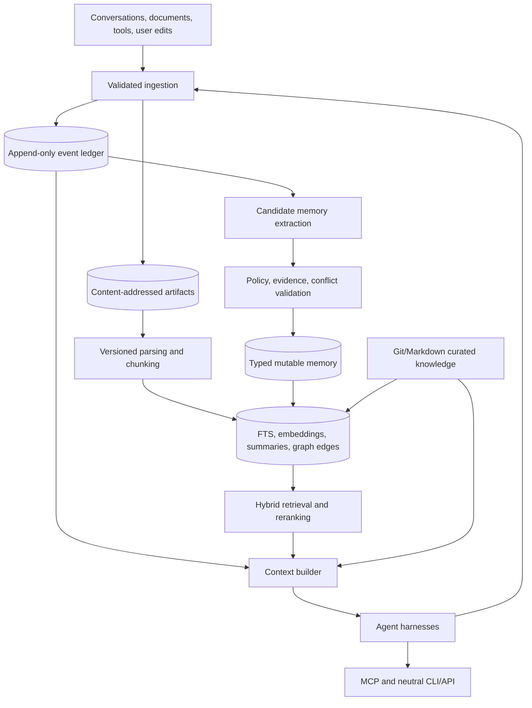

# A First-Class Second Brain for AI Agents

## Research synthesis and implementation blueprint

**Status:** Proposed architecture for review  
**Research cutoff:** 2026-08-02  
**Initial target:** Local-first, single-user, production-ready design with a clean path to shared deployment  
**Intended clients:** Claude Code, OpenAI Codex and Agents SDK, OpenCode, Cursor, Aider, custom MCP clients, and future agent harnesses

---

## 1. Executive Summary

A first-class agent "second brain" is not a vector database and is not a large folder of notes. It is a durable state and knowledge system that can:

- preserve original evidence;
- remember selected information across sessions;
- distinguish facts, events, preferences, instructions, and transient task state;
- retrieve the right information within a bounded context budget;
- resolve updates and contradictions over time;
- expose the same knowledge safely to different agent harnesses;
- explain where every important memory came from;
- forget information completely when requested; and
- survive changes in models, embedding providers, databases, and agent vendors.

The recommended architecture uses several deliberately separate layers:

1. **Curated knowledge:** Human-owned Markdown, `AGENTS.md`, Agent Skills, architecture records, policies, and runbooks stored in Git.
2. **Mutable memory:** SQLite records for events, typed memories, revisions, provenance, temporal validity, and retrieval feedback.
3. **Original evidence:** Immutable, content-addressed artifacts such as imported documents, conversations, HTML, and tool results.
4. **Derived retrieval data:** FTS5 rows, chunks, embeddings, summaries, and graph edges that can always be rebuilt.
5. **Interoperability:** A neutral CLI and API, plus MCP resources and tools. Harness-specific files are generated adapters, not canonical state.

For the initial local deployment, use **SQLite plus FTS5**, not MySQL. Add local embeddings only after lexical retrieval is measured. For a shared server, migrate the relational model to **PostgreSQL plus pgvector**. A dedicated vector or graph database should be added only when measured scale or latency requires it.

The central principle is:

> Preserve evidence and history in boring, inspectable storage. Treat chunks, embeddings, summaries, confidence scores, graph edges, and rendered model context as replaceable projections.

---

## 2. Research Method

This report synthesizes:

- official documentation and engineering guidance from OpenAI, Anthropic, Google, AWS, Microsoft, LangChain, LlamaIndex, Letta, and major storage projects;
- work from respected practitioners including Simon Willison, Chip Huyen, Lilian Weng, Harrison Chase, Hamel Husain, and Dex Horthy;
- academic work including MemGPT, Generative Agents, Reflexion, LoCoMo, LongMemEval, MemoryAgentBench, BEIR, GraphRAG, and security research; and
- interoperability standards and conventions including MCP, Agent Skills, `AGENTS.md`, JSON Schema, JSON-RPC, and content-addressed artifacts.

Primary sources were preferred. Vendor-reported benchmarks are identified as such and should not be treated as independent validation. Live product documentation, protocol revisions, and harness behavior can change; compatibility claims should be tested against pinned versions during implementation.

---

## 3. Terms That Must Remain Distinct

Many weak memory designs fail because they use "memory" for several unrelated mechanisms.

| Term | Meaning | Durable? | Authoritative? |
|---|---|---:|---:|
| Working context | Instructions, recent turns, retrieved passages, and tool results visible to one model call | No | No |
| Session history | Ordered messages and tool events associated with one thread | Usually | Evidence, if retained unchanged |
| Checkpoint | Serialized workflow state that permits exact or approximate resumption | Usually | For workflow recovery |
| Compaction | A shortened representation of prior context | Sometimes | No; it is lossy or provider-specific |
| Episodic memory | Selected experiences, meetings, outcomes, or trajectories | Yes | Only with provenance |
| Semantic memory | Extracted facts, concepts, profiles, and preferences | Yes | Only with evidence and temporal scope |
| Procedural memory | Instructions, workflows, prompts, skills, and lessons | Yes | Curated procedural knowledge can be authoritative |
| Knowledge/RAG | External documents and curated reference material | Yes | The source document may be authoritative |
| Retrieval index | FTS, vector, graph, or ranking data used to find records | Rebuildable | No |

### 3.1 Key consequences

- A conversation checkpoint is not a user profile.
- A vector search result is not proof that a claim is true.
- Prompt caching changes cost, not persistence.
- Compaction prevents context overflow but cannot replace the source history.
- RAG searches external knowledge; memory additionally includes information learned from interaction.
- A larger context window does not solve relevance, provenance, stale facts, deletion, or authorization.

---

## 4. Findings From Major Vendors and Frameworks

### 4.1 OpenAI

OpenAI separates conversation state, SDK sessions, compaction, and file search:

- Conversations and response chaining preserve thread continuity.
- Agents SDK sessions can persist history in SQLite, Redis, SQL, MongoDB, Dapr, or provider-managed storage.
- Compaction creates a smaller continuation state; provider-generated opaque compaction is not a portable knowledge format.
- File search combines keyword and semantic retrieval over uploaded files.

**Implication:** Preserve application-owned events and knowledge independently. Provider conversations are useful adapters, but they are not a cross-vendor second brain.

Sources:

- [OpenAI conversation state](https://developers.openai.com/api/docs/guides/conversation-state)
- [OpenAI compaction](https://developers.openai.com/api/docs/guides/compaction)
- [OpenAI Agents SDK sessions](https://openai.github.io/openai-agents-python/sessions/)
- [OpenAI file search](https://developers.openai.com/api/docs/guides/tools-file-search)
- [OpenAI data controls](https://platform.openai.com/docs/guides/your-data)

### 4.2 Anthropic and Claude Code

Anthropic explicitly describes the model context as working memory. Its memory tool delegates storage operations to the client, allowing files, databases, object storage, or encrypted storage. Claude Code combines:

- human-authored `CLAUDE.md` instructions;
- machine-authored Markdown auto-memory;
- a small index loaded early; and
- topic files loaded on demand.

Anthropic's context-engineering guidance emphasizes small, high-signal context, just-in-time retrieval, structured notes, compaction, and subagents.

**Implication:** A concise memory index with on-demand detail is a strong agent-facing interface. Machine-local auto-memory should be treated as a cache or review inbox, not shared authority.

Sources:

- [Anthropic memory tool](https://docs.anthropic.com/en/docs/agents-and-tools/tool-use/memory-tool)
- [Claude Code memory](https://code.claude.com/docs/en/memory)
- [Effective context engineering for AI agents](https://www.anthropic.com/engineering/effective-context-engineering-for-ai-agents)
- [Anthropic context windows](https://docs.anthropic.com/en/docs/build-with-claude/context-windows)
- [Anthropic prompt-injection mitigations](https://docs.anthropic.com/en/docs/test-and-evaluate/strengthen-guardrails/mitigate-jailbreaks)

### 4.3 Google ADK and Memory Bank

Google ADK makes a useful explicit distinction among:

- sessions and event history;
- mutable state with invocation, session, user, and application scopes; and
- searchable cross-session memory.

Google's managed Memory Bank adds extraction, consolidation, revisions, TTLs, identity-scoped retrieval, direct writes, and asynchronous event ingestion. Google also warns about memory poisoning.

**Implication:** Memory scope must be a first-class field. Cross-session user memory and application-global memory need stronger authorization than a conversation ID.

Sources:

- [Google ADK sessions](https://google.github.io/adk-docs/sessions/session/)
- [Google ADK state](https://google.github.io/adk-docs/sessions/state/)
- [Google ADK memory](https://google.github.io/adk-docs/sessions/memory/)
- [Google ADK compaction](https://google.github.io/adk-docs/context/compaction/)
- [Google Memory Bank](https://docs.cloud.google.com/gemini-enterprise-agent-platform/scale/memory-bank)

### 4.4 AWS AgentCore Memory

AWS separates short-term raw session events from long-term memories asynchronously extracted and consolidated into summaries, facts, and preferences.

AWS reports task-dependent compression and retrieval results, but these are vendor evaluations rather than independent evidence. Its documented extraction latency reinforces that memory writes should usually occur off the user-facing critical path.

**Implication:** Recent raw events provide immediate continuity. Long-term records are delayed, compressed indexes that need source links and a fallback to original events.

Sources:

- [AWS AgentCore Memory](https://docs.aws.amazon.com/bedrock-agentcore/latest/devguide/memory.html)
- [AWS AgentCore memory types](https://docs.aws.amazon.com/bedrock-agentcore/latest/devguide/memory-types.html)
- [AWS long-term memory deep dive](https://aws.amazon.com/blogs/machine-learning/building-smarter-ai-agents-agentcore-long-term-memory-deep-dive/)

### 4.5 Microsoft AutoGen and Semantic Kernel

AutoGen exposes versioned state save/load APIs and a pluggable memory protocol. Semantic Kernel separates message history reducers from vector-store connectors.

**Implication:** Framework state can be serialized, but the resulting schema remains coupled to framework components and versions. Use it for checkpoints, not as the canonical interchange format for long-term memory.

Sources:

- [AutoGen state](https://microsoft.github.io/autogen/stable/user-guide/agentchat-user-guide/tutorial/state.html)
- [AutoGen memory](https://microsoft.github.io/autogen/stable/user-guide/agentchat-user-guide/memory.html)
- [Semantic Kernel chat history](https://learn.microsoft.com/en-us/semantic-kernel/concepts/ai-services/chat-completion/chat-history)
- [Semantic Kernel vector stores](https://learn.microsoft.com/en-us/semantic-kernel/concepts/vector-store-connectors/)

### 4.6 LangGraph and LangChain

LangGraph provides one of the clearest distinctions:

- checkpointers persist thread-scoped graph snapshots;
- stores persist cross-thread documents; and
- semantic, episodic, and procedural memory have different roles.

**Implication:** Use separate retention, schema, and authorization policies for workflow checkpoints and long-term memory.

Sources:

- [LangGraph persistence](https://docs.langchain.com/oss/python/langgraph/persistence)
- [LangChain memory overview](https://docs.langchain.com/oss/python/concepts/memory)
- [LangChain short-term memory](https://docs.langchain.com/oss/python/langchain/short-term-memory)
- [LangChain long-term memory](https://docs.langchain.com/oss/python/langchain/long-term-memory)

### 4.7 LlamaIndex

LlamaIndex combines a bounded recent-message buffer with memory blocks for static data, facts, and vector retrieval. It also supplies persistent chat stores and serializable workflow state.

**Implication:** The buffer/block model is useful for context construction, but durable governance, temporal updates, and procedural memory remain application responsibilities.

Sources:

- [LlamaIndex agent memory](https://developers.llamaindex.ai/python/framework/module_guides/deploying/agents/memory/)
- [LlamaIndex agent state](https://developers.llamaindex.ai/python/framework/understanding/agent/state/)
- [LlamaIndex chat stores](https://developers.llamaindex.ai/python/framework/module_guides/storing/chat_stores/)

### 4.8 Letta and MemGPT

MemGPT frames context management as an operating-system-like hierarchy. The agent can move information between pinned core memory, conversation recall, and archival storage. Letta's later work argues that familiar filesystem tools and asynchronous "sleep-time" consolidation can be highly effective.

Letta reports strong LoCoMo results using file search, but those results are vendor-reported and retrieval-heavy. They support a narrower conclusion: simple, iterative, inspectable tools can compete with opaque memory services.

**Implication:** Give agents excellent read/search interfaces and allow them to propose memory operations. Deterministic code should validate and commit those operations.

Sources:

- [MemGPT paper](https://arxiv.org/abs/2310.08560)
- [Letta: Agent Memory](https://www.letta.com/blog/agent-memory/)
- [Letta filesystem memory benchmark](https://www.letta.com/blog/benchmarking-ai-agent-memory/)
- [Sleep-time compute](https://arxiv.org/abs/2504.13171)

---

## 5. Guidance From the Agentic Engineering Community

### 5.1 Simon Willison

Willison's description of context engineering is a useful design test: provide enough correctly selected information that the task is plausibly solvable. This shifts attention from clever prompt wording to the complete input assembled for each inference.

**Practice:** Record what was selected, what was omitted, its ordering, the tools available, and the context budget.

Source: [Context engineering](https://simonwillison.net/2025/Jun/27/context-engineering/)

### 5.2 Chip Huyen

Huyen emphasizes that tools define the agent's environment and that reliability compounds poorly over long trajectories. Read and write actions should be distinguished; plans, arguments, and consequential effects should be validated.

**Practice:** Keep memory tools few, narrow, typed, inspectable, and independently authorized.

Source: [Agents](https://huyenchip.com/2025/01/07/agents.html)

### 5.3 Lilian Weng

Weng's planning-memory-tools decomposition remains foundational. External retrieval expands capacity but does not reproduce full attention over the original history, and natural language is an unreliable component interface.

**Practice:** Test whether the agent can decide to search, formulate a useful query, recover evidence, and use it correctly. Do not evaluate only vector similarity.

Source: [LLM Powered Autonomous Agents](https://lilianweng.github.io/posts/2023-06-23-agent/)

### 5.4 Harrison Chase

Chase argues that many apparent model failures are context-construction failures. Tool schemas, tool errors, prior interactions, and retrieved knowledge all form part of the context.

**Practice:** Make the context builder versioned and observable. Trace selected memories, rendered context, token counts, and model output.

Source: [The rise of context engineering](https://blog.langchain.com/the-rise-of-context-engineering/)

### 5.5 Hamel Husain

Husain emphasizes domain-specific evaluation and trace inspection. Teams plateau when they alter prompts, models, and retrieval without turning observed failures into regression cases.

**Practice:** Build memory-specific tests for recall, source attribution, current-versus-superseded facts, abstention, deletion, contamination, and latency.

Source: [Your AI Product Needs Evals](https://hamel.dev/blog/posts/evals/)

### 5.6 Dex Horthy and 12-Factor Agents

The 12-Factor Agents project advocates application-owned context and event-sourced execution state. The model should act more like a reducer over carefully rendered state than the owner of opaque state.

**Practice:** Keep an append-only event ledger, reconstruct model context as a projection, and keep security controls outside model-editable memory.

Sources:

- [12-Factor Agents](https://github.com/humanlayer/12-factor-agents)
- [Own your context window](https://github.com/humanlayer/12-factor-agents/blob/main/content/factor-03-own-your-context-window.md)
- [Unify execution and business state](https://github.com/humanlayer/12-factor-agents/blob/main/content/factor-05-unify-execution-state.md)

### 5.7 Academic contributions

| Work | Useful contribution | Limitation |
|---|---|---|
| [Generative Agents](https://arxiv.org/abs/2304.03442) | Retrieve episodes using relevance, recency, and importance; create evidence-linked reflections | Optimizes simulated believability more than factual correctness |
| [Reflexion](https://arxiv.org/abs/2303.11366) | Converts grounded feedback into short procedural lessons | Bad evaluators produce bad lessons |
| [SWE-agent](https://arxiv.org/abs/2405.15793) | Shows that concise agent-computer interfaces materially affect performance | Focused on coding agents |
| [LoCoMo](https://arxiv.org/abs/2402.17753) | Long-term conversational QA and summarization | Does not fully test online memory maintenance |
| [LongMemEval](https://arxiv.org/abs/2410.10813) | Extraction, multi-session reasoning, temporal updates, and abstention | Final QA scores can conceal stage-specific failures |
| [MemoryAgentBench](https://arxiv.org/abs/2507.05257) | Incremental retrieval, test-time learning, long-range understanding, and forgetting | Newer and less independently replicated |

---

## 6. Where the Research Agrees

1. Context windows are working memory, not durable storage.
2. Raw history and derived knowledge have different purposes.
3. Retrieval quality is necessary but insufficient.
4. More context can reduce quality by introducing stale or irrelevant material.
5. Reflection is useful only when grounded in credible feedback.
6. Interface design materially affects agent capability.
7. Memory maintenance must be evaluated separately from final answer generation.
8. Cross-session scope and identity must be explicit.
9. Lossy summaries should never become the only copy of important information.
10. Application-owned, portable state is the safest long-term foundation.

### 6.1 Important disagreements

**Who controls writes?** MemGPT gives the model substantial control; 12-Factor Agents favors application-owned state. The recommended compromise is model-proposed, code-validated writes.

**Are vectors enough?** No consistent evidence supports this. Strong systems add lexical search, metadata, recency, temporal structure, iterative search, reranking, or graphs.

**Should memory be compressed immediately?** Early compression is efficient but can discard details needed by unknown future questions. Preserve raw evidence and build replaceable summaries asynchronously.

**Can files be canonical?** Yes for curated, human-owned knowledge and small single-writer vaults. No for concurrent mutable claims, revisions, ACLs, and transactional updates. This design uses files and a relational database where each is strongest.

---

## 7. Recommended Architecture



### 7.1 Sources of truth

There are two legitimate canonical authorities:

1. **Git and plain files** are authoritative for curated instructions, policies, skills, runbooks, and human-authored reference knowledge.
2. **SQLite** is authoritative for mutable events, extracted memories, revisions, temporal claims, tombstones, and retrieval feedback.

Original artifact bytes are separately authoritative evidence. FTS rows, chunks, embeddings, summaries, and graph edges are never authoritative.

### 7.2 Recommended repository layout

```text
brain/
|-- AGENTS.md
|-- docs/
|   |-- RESEARCH.md
|   |-- architecture/
|   |-- decisions/
|   `-- runbooks/
|-- knowledge/
|   |-- policies/
|   |-- references/
|   `-- schemas/
|-- .agents/
|   `-- skills/
|-- data/
|   |-- brain.sqlite3
|   `-- artifacts/
|       `-- sha256/
|-- exports/
|   |-- markdown/
|   `-- jsonl/
|-- interoperability/
|   |-- manifest.json
|   |-- manifest.schema.json
|   `-- adapters/
`-- src/
```

The database and private artifacts should normally be excluded from Git. Curated knowledge, schemas, migrations, and deterministic adapters should be committed.

---

## 8. Canonical Data Model

### 8.1 Core entities

| Entity | Purpose |
|---|---|
| `principals` | Users, agents, and services that read or write memory |
| `workspaces` | Isolation and sharing boundary |
| `sessions` | Conversation or workflow scope |
| `events` | Immutable messages, tool calls, observations, and feedback |
| `artifacts` | Stable identity for imported source material |
| `artifact_revisions` | Immutable bytes/text revisions with hashes |
| `chunks` | Rebuildable structural excerpts from revisions |
| `memories` | Stable identity and type for a durable memory |
| `memory_revisions` | Immutable versions of memory content and status |
| `memory_evidence` | Links memory revisions to source events or chunks |
| `relations` | Evidence-bearing links among entities and memories |
| `embeddings` | Model-versioned derived vectors |
| `summaries` | Evidence-linked, replaceable consolidations |
| `retrieval_feedback` | Which results were cited, accepted, or rejected |
| `tombstones` | Deletion propagation and anti-resurrection records |

### 8.2 Memory types

- `episodic`: meetings, conversations, observations, and outcomes;
- `semantic`: facts and concepts extracted from evidence;
- `preference`: user choices with effective dates;
- `procedural`: lessons, workflows, and reusable techniques;
- `task`: resumable task state with an expected short lifetime; and
- `profile`: a derived view of current user or project facts.

### 8.3 Minimum memory metadata

Every persisted memory revision should include:

- stable memory ID and immutable revision ID;
- workspace, owner, creator, and originating agent;
- type, status, visibility, and sensitivity;
- event time and ingestion time;
- `valid_from` and `valid_to` when the represented fact can change;
- source evidence IDs and exact quote spans where possible;
- extractor model, prompt, parser, and schema versions;
- confidence components rather than one unexplained score;
- supersedes, contradicts, or derived-from links;
- expiry or review time;
- content hash; and
- deletion state.

### 8.4 Bitemporal facts

Use two forms of time:

- **Valid time:** when the fact was true in the represented world.
- **Transaction time:** when the brain learned or recorded it.

This permits answers to both "What was true on June 1?" and "What did the system believe on June 1?" Corrections should add a new revision and close or dispute the old validity interval rather than overwrite history.

### 8.5 Conceptual SQLite schema

```sql
CREATE TABLE events (
    id TEXT PRIMARY KEY,
    workspace_id TEXT NOT NULL,
    session_id TEXT,
    actor_id TEXT NOT NULL,
    kind TEXT NOT NULL,
    occurred_at TEXT NOT NULL,
    ingested_at TEXT NOT NULL,
    payload_json TEXT NOT NULL,
    content_hash TEXT NOT NULL,
    idempotency_key TEXT,
    UNIQUE (workspace_id, idempotency_key)
);

CREATE TABLE memories (
    id TEXT PRIMARY KEY,
    workspace_id TEXT NOT NULL,
    memory_type TEXT NOT NULL,
    owner_id TEXT,
    created_at TEXT NOT NULL
);

CREATE TABLE memory_revisions (
    id TEXT PRIMARY KEY,
    memory_id TEXT NOT NULL REFERENCES memories(id),
    revision_number INTEGER NOT NULL,
    status TEXT NOT NULL,
    content_markdown TEXT NOT NULL,
    structured_json TEXT,
    valid_from TEXT,
    valid_to TEXT,
    recorded_at TEXT NOT NULL,
    confidence_json TEXT,
    supersedes_revision_id TEXT,
    extractor_version TEXT,
    content_hash TEXT NOT NULL,
    UNIQUE (memory_id, revision_number)
);

CREATE TABLE memory_evidence (
    memory_revision_id TEXT NOT NULL REFERENCES memory_revisions(id),
    event_id TEXT REFERENCES events(id),
    chunk_id TEXT,
    relation TEXT NOT NULL,
    quote_start INTEGER,
    quote_end INTEGER,
    PRIMARY KEY (memory_revision_id, event_id, chunk_id)
);

CREATE VIRTUAL TABLE searchable_content USING fts5(
    object_id UNINDEXED,
    object_type UNINDEXED,
    title,
    body,
    tags,
    tokenize = 'unicode61'
);
```

The production schema should add foreign keys, strict constraints, indexes, migrations, permissions, tombstones, artifacts, chunks, and retrieval feedback. IDs should be stable random or time-sortable identifiers; paths and titles must not serve as identity.

---

## 9. Markdown and Artifact Conventions

Markdown is the preferred human-facing format because it is inspectable, diffable, portable, and well understood by agent harnesses. HTML should be retained when it is source evidence, not used as the normalized memory format.

Recommended front matter for curated documents:

```yaml
---
id: urn:brain:doc:architecture-memory-v1
title: Memory Architecture
kind: architecture
status: accepted
created: 2026-08-02
updated: 2026-08-02
owners:
  - user:cowen
tags:
  - agents
  - memory
---
```

Rules:

- assign stable IDs independent of file paths;
- use UTF-8 and LF line endings;
- use relative links inside portable packages;
- preserve source URLs, capture dates, and hashes;
- keep generated projections clearly marked;
- do not place secrets in front matter or content;
- define a versioned front-matter schema; and
- export mutable memory to Markdown, but do not require agents to edit database projections directly.

Original files should be stored by content hash, for example:

```text
data/artifacts/sha256/ab/cd/abcdef.../source.html
```

The artifact record should preserve the original URI, media type, capture time, exact digest, parser version, and access policy.

---

## 10. Memory Write and Consolidation Pipeline

### 10.1 Write path

1. Append the source event before deriving a memory.
2. Classify sensitivity and determine scope.
3. Extract candidate typed memories.
4. Link each candidate to exact evidence.
5. Check for duplicates, contradictions, and temporal updates.
6. Apply policy, retention, and authorization rules.
7. Require review for sensitive facts and procedural memories.
8. Commit an immutable memory revision through deterministic code.
9. Update rebuildable indexes asynchronously.
10. Record the write decision and extractor version.

The model may propose this operation:

```json
{
  "operation": "propose_memory",
  "type": "preference",
  "content": "The user prefers concise implementation summaries.",
  "scope": "user",
  "evidence": ["event:01..."],
  "valid_from": "2026-08-02T00:00:00Z",
  "confidence": {
    "extraction": 0.92,
    "source_authority": "direct-user-statement"
  }
}
```

It must not receive unrestricted SQL access or silently mark its own proposal as trusted.

### 10.2 Consolidation

Run consolidation outside the interactive latency path:

```text
raw events
  -> event/session summaries
  -> topic or entity summaries
  -> current profile views
```

Every summary must retain its source revision set, model/prompt version, coverage, generation time, and supersession history. Regenerate summaries when their inputs change. Avoid recursively summarizing summaries without checking original evidence.

### 10.3 Procedural learning

Procedural lessons are unusually dangerous because they can change future behavior. Only retain lessons grounded in:

- passing or failing tests;
- explicit environment outcomes;
- verified human feedback;
- authoritative operational records; or
- repeated measured success.

Store the failed action, observed evidence, proposed correction, applicable scope, and expiry/review condition. Agent-authored instructions should enter a review queue before promotion to an Agent Skill or `AGENTS.md`.

---

## 11. Retrieval Architecture

### 11.1 Baseline

Start with SQLite FTS5. It supports phrase, prefix, proximity, Boolean, column-filtered, highlighted, and BM25-ranked search without another service.

Source: [SQLite FTS5](https://www.sqlite.org/fts5.html)

Lexical search is particularly strong for:

- names and exact phrases;
- code symbols and file paths;
- identifiers and part numbers;
- rare terms;
- recently introduced vocabulary; and
- searches where spelling matters.

### 11.2 Add dense retrieval only after measurement

Dense retrieval helps with paraphrase and conceptual similarity. It should store:

- embedding model and exact version;
- dimensions and distance metric;
- input object and revision;
- preprocessing/chunker version; and
- generation timestamp.

For a modest local corpus, exact vector search in process may be sufficient. A pinned SQLite vector extension can be considered after compatibility and security review. Do not add a vector server to the MVP.

### 11.3 Hybrid pipeline

```text
1. Authenticate and determine permissible scopes.
2. Parse requested time, entities, identifiers, and memory classes.
3. Apply workspace, ACL, deletion, and time filters.
4. Retrieve lexical top 50-200.
5. Retrieve dense top 50-200 when enabled.
6. Fuse ranks using Reciprocal Rank Fusion.
7. Add bounded source-quality, validity, recency, and pin signals.
8. Rerank the best 20-100 candidates when quality justifies the latency.
9. Deduplicate and diversify.
10. Return evidence spans, provenance, and conflict warnings.
```

Reciprocal Rank Fusion avoids incorrectly adding BM25 and cosine scores from incompatible scales:

```text
RRF(document) = sum(1 / (k + rank_in_result_list))
```

Source: [Reciprocal Rank Fusion paper](https://plg.uwaterloo.ca/~gvcormac/cormacksigir09-rrf.pdf)

BEIR found BM25 to be a robust zero-shot baseline while reranking and late-interaction methods often improve quality at higher cost. This supports hybrid retrieval rather than dense-only design.

Sources:

- [Dense Passage Retrieval](https://arxiv.org/abs/2004.04906)
- [BEIR](https://arxiv.org/abs/2104.08663)
- [Multi-stage BERT ranking](https://arxiv.org/abs/1910.14424)
- [ColBERTv2](https://arxiv.org/abs/2112.01488)

### 11.4 Ranking signals

Use relevance as the dominant signal, with bounded additions for:

- exact identifier matches;
- requested valid-time overlap;
- source authority;
- direct user confirmation;
- recency for inherently volatile facts;
- pinned importance;
- task and workspace scope; and
- unresolved contradiction penalties.

Decay should affect activation, not truth. A verified old fact does not become false because it is old. Different memory classes require different decay and review policies.

### 11.5 Knowledge graphs

Graphs can help with multi-hop relationships, dependencies, temporal links, contradiction traversal, and corpus-wide themes. They also introduce entity-resolution errors and operational complexity.

Begin with a relational `relations` table and recursive SQL. Add a graph database only after demonstrated graph workloads justify it. Extracted edges must cite evidence and remain derived assertions.

Sources:

- [GraphRAG](https://arxiv.org/abs/2404.16130)
- [HippoRAG](https://arxiv.org/abs/2405.14831)

---

## 12. Storage Decision

### 12.1 Recommended tiers

| Tier | Canonical store | Retrieval | Use case |
|---|---|---|---|
| Local MVP | SQLite plus Git/Markdown | FTS5 | One user, thousands of notes |
| Local power user | SQLite plus content-addressed artifacts | FTS5, local embeddings, RRF, optional reranker | Several local agents, larger corpus |
| Shared production | PostgreSQL plus object storage | PostgreSQL FTS, pgvector, RRF, reranker | Multi-user service with ACLs and workers |
| Retrieval intensive | PostgreSQL remains canonical | Dedicated vector/search projection | Very large corpus or strict latency/QPS |

### 12.2 Why SQLite first

- embedded and local-first;
- transactional and constraint-capable;
- FTS5 is mature;
- minimal administration;
- easily backed up with supported APIs;
- suitable for an application file format; and
- straightforward to migrate from when the schema is disciplined.

SQLite permits many readers but one writer. Use short transactions, WAL mode on a local filesystem, busy timeouts, and a controlled write service. Never place a live WAL database on a network filesystem.

Sources:

- [SQLite as an application file format](https://www.sqlite.org/appfileformat.html)
- [SQLite WAL](https://www.sqlite.org/wal.html)
- [SQLite backup API](https://www.sqlite.org/backup.html)

### 12.3 Why PostgreSQL for shared production

PostgreSQL provides strong concurrency, transactions, rich metadata queries, row-level security, configurable full-text search, mature backup/PITR, and pgvector integration.

Sources:

- [PostgreSQL full-text search](https://www.postgresql.org/docs/current/textsearch.html)
- [pgvector](https://github.com/pgvector/pgvector)
- [PostgreSQL row security](https://www.postgresql.org/docs/current/ddl-rowsecurity.html)
- [PostgreSQL backups](https://www.postgresql.org/docs/current/backup.html)

### 12.4 Why not MySQL as a greenfield retrieval sidecar

MySQL is reasonable when it already owns the canonical data and its lexical capabilities meet requirements. It is not the recommended greenfield quick-retrieval layer because:

- vector support differs substantially among upstream MySQL, Cloud SQL, HeatWave, and MySQL-compatible providers;
- provider-specific vector syntax and indexes increase migration risk;
- full-text ranking and analyzers are less flexible than dedicated search engines;
- filtered approximate-nearest-neighbor behavior varies by provider;
- adding MySQL only as a cache creates another backup and synchronization boundary; and
- SQLite is simpler locally while PostgreSQL is stronger for the planned shared deployment.

Sources:

- [MySQL full-text search](https://docs.oracle.com/cd/E17952_01/mysql-8.0-en/fulltext-search.html)
- [MySQL full-text restrictions](https://docs.oracle.com/cd/E17952_01/mysql-8.0-en/fulltext-restrictions.html)
- [Cloud SQL vector search](https://cloud.google.com/sql/docs/mysql/vector-search)
- [PlanetScale vectors](https://planetscale.com/docs/vitess/vectors)

Use MySQL if operational ownership and measured benchmarks make it the lowest-risk choice, not because "indexes" imply it is automatically the fastest retrieval system.

### 12.5 Dedicated retrieval services

Qdrant, Elasticsearch/OpenSearch, or Vespa can become rebuildable projections when requirements include very high vector QPS, extensive hybrid ranking, quantization, multi-vector representations, or independent search scaling.

The canonical database must feed them through an outbox or change stream. Every indexed record must retain the canonical revision ID so stale and deleted results can be rejected.

Sources:

- [Qdrant filtering](https://qdrant.tech/documentation/search/filtering/)
- [Qdrant hybrid queries](https://qdrant.tech/documentation/search/hybrid-queries/)

---

## 13. Cross-Harness Interoperability

No standard currently represents session state, semantic memory, episodic memory, procedural knowledge, tools, and packaging together. Interoperability therefore requires several complementary mechanisms.

### 13.1 Portable core

- `AGENTS.md` for concise repository instructions;
- `.agents/skills/<name>/SKILL.md` for reusable procedures;
- ordinary Markdown and structured JSON for curated reference material;
- a versioned JSON manifest and JSON Schema;
- stable URIs and SHA-256 content digests;
- MCP resources and tools for runtime access; and
- Markdown/JSONL exports for recovery and migration.

Sources:

- [AGENTS.md](https://agents.md/)
- [Agent Skills specification](https://agentskills.io/specification)
- [JSON Schema 2020-12](https://json-schema.org/draft/2020-12/json-schema-core)
- [JSON RFC 8259](https://www.rfc-editor.org/rfc/rfc8259)
- [JSON Text Sequences RFC 7464](https://www.rfc-editor.org/rfc/rfc7464)

### 13.2 MCP design

Expose durable knowledge in two forms:

**Resources:**

- stable `brain://` URIs;
- media type, revision, digest, and last-modified metadata;
- addressable documents and memory records; and
- resource templates for workspace, topic, entity, and time.

**Read-only tool fallback:**

- `brain.search`
- `brain.get`
- `brain.list_collections`
- `brain.get_history`
- `brain.explain_provenance`

**Controlled write tools:**

- `brain.propose_memory`
- `brain.correct_memory`
- `brain.forget`
- `brain.promote_to_knowledge`

Write tools require deterministic validation, authorization, idempotency keys, and audit records. They should return structured content plus a text fallback for less capable clients.

MCP defines resources, prompts, and tools but does not define a universal long-term-memory schema. Maintain the canonical schema in this project.

Source: [Model Context Protocol specification](https://modelcontextprotocol.io/specification/2026-07-28)

The 2026-07-28 MCP revision was very new at this report's cutoff and materially changes earlier session and discovery behavior. Implement protocol negotiation and compatibility testing rather than assuming every harness supports the newest revision.

### 13.3 Harness adapters

| Harness | Adapter |
|---|---|
| Claude Code | `CLAUDE.md` imports `AGENTS.md`; mirror or link `.agents/skills` into `.claude/skills`; generated MCP config |
| OpenAI Codex | Native `AGENTS.md` and `.agents/skills`; generated MCP config |
| OpenCode | Native `AGENTS.md` and compatible skill paths; generated `opencode.json` MCP entry |
| Cursor | Native `AGENTS.md` and `.agents/skills`; generate Cursor rules only when needed |
| Aider | Launch with `--read AGENTS.md`; provide Markdown and CLI fallback because native MCP/skills support is limited |
| Custom clients | MCP plus neutral HTTP/CLI interface |

Harness-local memory and provider session objects are caches. Promote durable discoveries through an explicit reviewed operation.

### 13.4 Neutral CLI

```text
brain init
brain ingest <path-or-url>
brain remember --type <type> --evidence <id>
brain search <query> [--as-of <time>] [--scope <scope>]
brain get <uri-or-id>
brain history <id>
brain correct <id>
brain forget <id>
brain export --format markdown|jsonl
brain validate
brain reindex
brain evaluate
brain serve-mcp
brain adapter generate --target claude|codex|cursor|opencode|aider
```

Machine-readable output should use versioned JSON or JSON Text Sequences, stable exit codes, stdout for data, stderr for diagnostics, and `--dry-run` for mutation and adapter generation.

---

## 14. Security, Privacy, and Governance

Persistent memory creates durable attack effects. Retrieved memory is untrusted data, never authority.

### 14.1 Prompt injection and poisoning

OWASP states that RAG does not eliminate prompt injection and no foolproof prevention method is known. PoisonedRAG, AgentPoison, and later work demonstrate that malicious documents or interactions can manipulate future retrieval and behavior.

Required controls:

- represent retrieved content as typed, source-labeled data;
- never place retrieved text in system or developer instruction channels;
- scan imports and retrievals for hidden or instruction-like content;
- quarantine suspicious content rather than silently rewriting it;
- prevent raw retrieved content from automatically becoming durable memory;
- validate candidate memories against evidence;
- keep tools independently authenticated and authorized;
- use read-only scopes by default;
- require approval for destructive, financial, privileged, or external actions;
- treat tool descriptions and memory metadata as untrusted; and
- test split payloads, Unicode obfuscation, hidden PDF/image text, and memory write-through.

Sources:

- [OWASP Prompt Injection](https://genai.owasp.org/llmrisk/llm01-prompt-injection/)
- [OWASP RAG Security Cheat Sheet](https://cheatsheetseries.owasp.org/cheatsheets/RAG_Security_Cheat_Sheet.html)
- [OWASP AI Agent Security Cheat Sheet](https://cheatsheetseries.owasp.org/cheatsheets/AI_Agent_Security_Cheat_Sheet.html)
- [PoisonedRAG](https://arxiv.org/abs/2402.07867)
- [AgentPoison](https://arxiv.org/abs/2407.12784)
- [MINJA](https://arxiv.org/abs/2503.03704)

### 14.2 Secrets and sensitive data

- Never store API keys, passwords, access tokens, cookies, or private keys as memories.
- Scan before persistence and before model output.
- Use OS keyrings or a secret manager.
- Treat embeddings as sensitive derived data, not anonymization.
- Minimize PII and provide inspect, correct, export, and forget operations.
- Encrypt local disks, databases, artifacts, backups, and transport.
- Keep encryption keys separate from encrypted data.

Embedding inversion research shows that source information can leak from embeddings:

- [Information leakage in embedding models](https://arxiv.org/abs/2004.00053)
- [Generative embedding inversion](https://arxiv.org/abs/2305.03010)

### 14.3 Authorization and isolation

For the local single-user deployment, rely on OS identity, restrictive permissions, full-disk encryption, and a non-networked database. Still maintain workspace and principal fields so migration does not require a data-model rewrite.

For shared production:

- derive tenant and user scope from authenticated server-side identity;
- enforce authorization before retrieval, not after results are exposed;
- carry ACLs to every chunk and derived object;
- scope caches by authorization context;
- use PostgreSQL row-level security or stronger isolation;
- separate ingest, read, write, delete, and backup service identities; and
- test cross-tenant retrieval with a zero-leakage release gate.

### 14.4 Audit and provenance

Record:

- principal, workspace, session, request, and trace IDs;
- memory creates, revisions, supersessions, and deletions;
- source and retrieved object IDs;
- authorization decisions;
- model, prompt, parser, embedding, and policy versions;
- tool requests, approvals, and effects; and
- backup restoration and deletion propagation.

Avoid logging secrets, full sensitive prompts, or unnecessary PII. Audit-log access must itself be audited.

W3C PROV's entity/activity/agent model is a useful conceptual basis:

- [W3C PROV Overview](https://www.w3.org/TR/prov-overview/)

### 14.5 Deletion and backups

Deletion must:

1. authenticate and authorize the request;
2. create a durable tombstone;
3. stop retrieval immediately;
4. remove source, chunks, embeddings, summaries, caches, and exports;
5. propagate to replicas and downstream indexes;
6. preserve only a content-free deletion receipt where appropriate; and
7. prevent old backups from resurrecting deleted records.

SQLite backups must use the online backup API or `VACUUM INTO`; copying only the main database while WAL transactions are active is unsafe. Test restore and complete reindex procedures regularly.

### 14.6 Governance frameworks

Use NIST AI RMF's Govern, Map, Measure, and Manage structure. Maintain a data flow map, memory inventory, prohibited data categories, retention policies, owners, release gates, and incident procedures.

Sources:

- [NIST AI RMF 1.0](https://doi.org/10.6028/NIST.AI.100-1)
- [NIST Generative AI Profile](https://doi.org/10.6028/NIST.AI.600-1)
- [NIST Privacy Framework](https://www.nist.gov/privacy-framework)
- [NIST SP 800-88 Rev. 2](https://doi.org/10.6028/NIST.SP.800-88r2)

---

## 15. Evaluation Strategy

End-to-end answer accuracy is not enough. Evaluate every memory stage.

### 15.1 Write evaluation

- Was a memory warranted?
- Was the correct type and scope selected?
- Does every claim have supporting evidence?
- Were secrets and sensitive data rejected?
- Were duplicates and contradictions identified?
- Was the update linked to the prior revision?

### 15.2 Maintenance evaluation

- Are superseded facts no longer returned as current?
- Are historical facts still available for valid `as_of` queries?
- Do summary regenerations preserve material facts?
- Do expiry and deletion propagate to every derived representation?
- Can restoring an old backup avoid resurrecting tombstoned data?

### 15.3 Retrieval evaluation

- recall@k;
- precision@k;
- hit rate@k;
- MRR and nDCG@k;
- multi-hop evidence coverage;
- stale or conflicting result rate;
- unauthorized result rate, with a required value of zero;
- ANN recall against exact search; and
- p50, p95, and p99 latency.

### 15.4 Answer evaluation

- claim faithfulness;
- citation precision and completeness;
- temporal validity;
- contradiction rate;
- correct abstention when evidence is absent;
- preference update and reversal accuracy; and
- task success in the actual environment.

### 15.5 Security evaluation

- prompt-injection attack success rate;
- poisoning/backdoor success rate;
- malicious memory acceptance rate;
- secret and PII leakage rate;
- cross-scope retrieval rate;
- unauthorized tool execution rate;
- stale ACL retrieval rate; and
- deletion resurrection rate.

Unauthorized retrieval, unauthorized execution, and deletion resurrection are zero-tolerance release gates.

### 15.6 Evaluation datasets

Build a versioned local suite with:

- exact identifiers and rare terms;
- paraphrased factual questions;
- multi-session synthesis;
- temporal updates and `as_of` questions;
- contradictions and false premises;
- no-answer/abstention cases;
- deletion and retention cases;
- malicious imported content;
- cross-workspace canaries; and
- representative production failures after privacy review.

Use public benchmarks to supplement, not replace, domain-specific tests:

- [LoCoMo](https://arxiv.org/abs/2402.17753)
- [LongMemEval](https://arxiv.org/abs/2410.10813)
- [MemoryAgentBench](https://arxiv.org/abs/2507.05257)
- [RAGAS](https://arxiv.org/abs/2309.15217)
- [ARES](https://arxiv.org/abs/2311.09476)
- [RAGTruth](https://arxiv.org/abs/2401.00396)
- [FreshQA](https://arxiv.org/abs/2310.03214)
- [CRAG](https://arxiv.org/abs/2406.04744)

---

## 16. Operational Requirements

### 16.1 Local baseline

- SQLite in WAL mode on a local filesystem;
- one controlled writer or short transactions with retries;
- restrictive filesystem permissions;
- full-disk encryption;
- encrypted off-device backups;
- regular integrity checks;
- a tested restore command;
- complete Markdown and JSONL export;
- deterministic index rebuild; and
- pinned parser, embedding, and schema versions.

### 16.2 Observability

Trace:

- query classification;
- authorization scope;
- lexical and dense candidate sets;
- fusion and reranking decisions;
- selected evidence and token budgets;
- final rendered context;
- model answer and cited sources;
- memory write proposals and decisions; and
- stage latency and cost.

Sensitive content should be redacted or represented by IDs in logs.

### 16.3 Migration boundary

The application should access storage through explicit repositories or services, but should not obscure SQL behind an elaborate generic abstraction. Keep domain operations stable:

- append event;
- propose and commit memory revision;
- retrieve current or historical revision;
- search within authorized scope;
- tombstone and purge;
- export; and
- rebuild projections.

Use SQL migrations compatible in concept with PostgreSQL. Avoid relying on SQLite behavior that cannot be reproduced, while still using FTS5 locally.

---

## 17. Implementation Roadmap

### Phase 0: Decisions and fixtures

- Approve this architecture.
- Define memory types, scope rules, stable IDs, and front-matter schema.
- Create representative evaluation fixtures before retrieval tuning.
- Write threat model and retention policy.

**Exit criteria:** Architecture decisions accepted and baseline tests defined.

### Phase 1: Durable local foundation

- Create SQLite migrations and content-addressed artifact storage.
- Implement append-only events, sessions, artifacts, memories, revisions, evidence, and tombstones.
- Implement safe backup, restore, export, and reindex commands.
- Add Git/Markdown curated knowledge conventions.

**Exit criteria:** Data survives restart and restore; every memory can show evidence; deletion blocks retrieval.

### Phase 2: Lexical retrieval and context builder

- Add FTS5 projections.
- Implement filters, phrase search, snippets, and provenance.
- Build a context budgeter for instructions, recent events, memory, knowledge, and tool output.
- Record retrieval and context traces.

**Exit criteria:** Baseline retrieval quality and latency targets pass on the local suite.

### Phase 3: Controlled memory lifecycle

- Add candidate extraction and deterministic validation.
- Implement duplicate, contradiction, supersession, and temporal handling.
- Add asynchronous consolidation and review queues.
- Add inspect, correct, promote, and forget workflows.

**Exit criteria:** Temporal update, contradiction, provenance, and deletion tests pass.

### Phase 4: Hybrid retrieval

- Select and pin an embedding model.
- Add exact local vector search first.
- Implement RRF and evaluate against lexical baseline.
- Add a reranker only if measured quality justifies latency and complexity.

**Exit criteria:** Hybrid retrieval provides a statistically and operationally meaningful gain.

### Phase 5: Cross-harness delivery

- Implement neutral CLI and structured output schemas.
- Add MCP resources and read-only tools.
- Add controlled write proposals.
- Generate adapters for Claude, Codex, OpenCode, Cursor, and Aider.
- Run conformance tests against pinned harness versions.

**Exit criteria:** The same memory can be found, cited, corrected, and forgotten through every supported harness.

### Phase 6: Production hardening

- Complete injection, poisoning, secret, backup, and deletion exercises.
- Add metrics, audit reports, and incident runbooks.
- Benchmark concurrency and corpus growth.
- Define the PostgreSQL/pgvector migration trigger and execute only when needed.

**Exit criteria:** Security gates pass and recovery is demonstrated from backup.

---

## 18. Initial Acceptance Criteria

The first production-ready local release should satisfy all of the following:

- Works fully offline except for explicitly configured model calls.
- Original evidence remains available after summarization and reindexing.
- Every durable memory has provenance or is explicitly marked human-authored.
- Corrected facts retain history and honor `as_of` queries.
- FTS and vector indexes can be deleted and rebuilt without data loss.
- No secret category is accepted as ordinary memory.
- Imported text cannot directly create trusted instructions.
- The model cannot bypass write validation or authorization.
- The user can inspect, correct, export, and forget memories.
- Backup restoration replays tombstones before serving queries.
- Retrieval returns source IDs and supporting excerpts.
- Evaluation reports write, retrieval, answer, temporal, security, latency, and cost metrics separately.
- Claude, Codex, OpenCode, Cursor, Aider, and a generic MCP client can access the same canonical knowledge through adapters.
- No provider session, vector store, embedding model, or proprietary format is required to recover the brain.

---

## 19. Rejected or Deferred Alternatives

### One giant Markdown vault as the entire database

Rejected for mutable memory because concurrent writes, transactional updates, temporal claims, ACLs, and deletion propagation become fragile. Retained for curated knowledge and exports.

### HTML as the normalized memory format

Rejected because it is noisy, difficult to diff, and unsafe to render without sanitization. Retain original HTML as immutable source evidence.

### Vector database as canonical memory

Rejected because vectors are model-specific, lossy, difficult to inspect, and poor at enforcing revisions, provenance, and transactions.

### MySQL as an auxiliary search cache

Rejected for the initial greenfield build because it adds operations without outperforming SQLite locally or PostgreSQL as the shared destination.

### Knowledge graph in the MVP

Deferred until multi-hop and relationship workloads demonstrate a measurable need. Start with relational edges.

### Fully autonomous memory writes

Rejected because poisoning, incorrect extraction, and self-reinforcing procedural errors can persist across sessions. Models propose; code validates and commits.

### Provider-managed memory as the only store

Rejected because export, deletion semantics, schemas, retention, and availability differ by vendor. Provider memory can remain an optional cache or adapter.

---

## 20. Final Recommendation

Build the second brain as a small, durable information system rather than a model feature:

1. Keep curated instructions and knowledge in Git-backed Markdown and Agent Skills.
2. Keep mutable events and typed memories in SQLite.
3. Preserve original artifacts by content hash.
4. Start retrieval with FTS5.
5. Add embeddings, fusion, reranking, and graphs only when evaluations prove their value.
6. Let models propose memory operations while deterministic services enforce evidence, scope, revisions, privacy, and deletion.
7. Expose the system through a neutral CLI/API and MCP, with generated harness adapters.
8. Treat every summary and index as rebuildable.
9. Evaluate the full memory lifecycle, including harmful recall and forgetting.
10. Migrate to PostgreSQL plus pgvector when sharing and concurrency justify it.

This approach is less fashionable than making a vector database the center of the design, but it is more portable, inspectable, secure, and likely to remain usable across model and harness generations.

---

## Appendix A: Additional Primary References

### Formats and local-first design

- [CommonMark](https://spec.commonmark.org/)
- [WHATWG HTML](https://html.spec.whatwg.org/)
- [Local-first software](https://www.inkandswitch.com/essay/local-first/)
- [RFC 6920: Naming Things with Hashes](https://www.rfc-editor.org/rfc/rfc6920.html)
- [XDG Base Directory specification](https://specifications.freedesktop.org/basedir-spec/latest/)

### Agent interfaces and packaging

- [Claude Code skills](https://code.claude.com/docs/en/skills)
- [OpenAI Codex AGENTS.md](https://developers.openai.com/codex/guides/agents-md)
- [OpenAI Codex skills](https://developers.openai.com/codex/skills/)
- [OpenAI Codex MCP](https://developers.openai.com/codex/mcp/)
- [OpenCode rules](https://opencode.ai/docs/rules/)
- [OpenCode skills](https://opencode.ai/docs/skills/)
- [OpenCode MCP servers](https://opencode.ai/docs/mcp-servers/)
- [Cursor rules](https://cursor.com/docs/context/rules)
- [Cursor skills](https://cursor.com/docs/context/skills)
- [Cursor MCP](https://cursor.com/docs/context/mcp)
- [Aider conventions](https://aider.chat/docs/usage/conventions.html)

### Security standards

- [OWASP Sensitive Information Disclosure](https://genai.owasp.org/llmrisk/llm022025-sensitive-information-disclosure/)
- [OWASP Data and Model Poisoning](https://genai.owasp.org/llmrisk/llm042025-data-and-model-poisoning/)
- [OWASP Vector and Embedding Weaknesses](https://genai.owasp.org/llmrisk/llm082025-vector-and-embedding-weaknesses/)
- [OWASP Authorization Cheat Sheet](https://cheatsheetseries.owasp.org/cheatsheets/Authorization_Cheat_Sheet.html)
- [OWASP Logging Cheat Sheet](https://cheatsheetseries.owasp.org/cheatsheets/Logging_Cheat_Sheet.html)
- [OWASP Secrets Management Cheat Sheet](https://cheatsheetseries.owasp.org/cheatsheets/Secrets_Management_Cheat_Sheet.html)
- [NIST Zero Trust Architecture](https://doi.org/10.6028/NIST.SP.800-207)
- [GDPR official text](https://eur-lex.europa.eu/eli/reg/2016/679/oj)

### Retrieval, freshness, and conflict research

- [Lost in the Middle](https://arxiv.org/abs/2307.03172)
- [Astute RAG](https://arxiv.org/abs/2410.07176)
- [Graphiti temporal knowledge graph](https://arxiv.org/abs/2501.13956)
- [KILT](https://arxiv.org/abs/2009.02252)

## Appendix B: Review Questions

1. Which memory categories may be written without human approval?
2. Which sources are considered authoritative for conflicting facts?
3. What information must never be persisted?
4. What default retention periods apply to events, memories, artifacts, and audit data?
5. Should mutable private data remain outside the project directory by default?
6. Which local embedding model, if any, meets the privacy and quality requirements?
7. Which harness versions are the first interoperability targets?
8. What corpus size, query latency, and concurrency should trigger PostgreSQL migration?
9. Which actions require interactive approval even for a trusted local user?
10. What evaluation thresholds constitute the first release gate?
